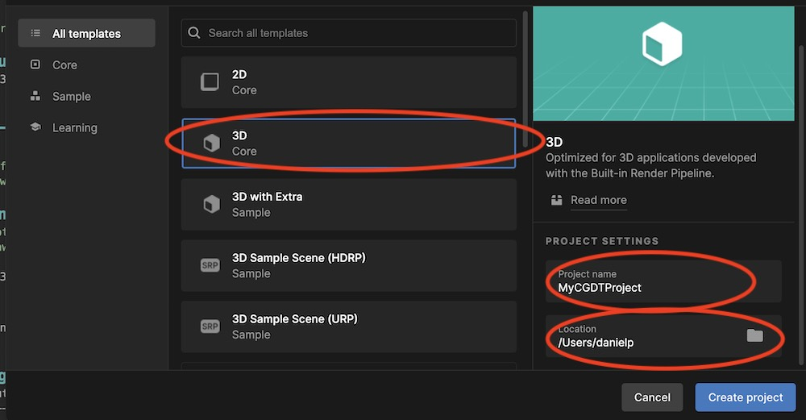
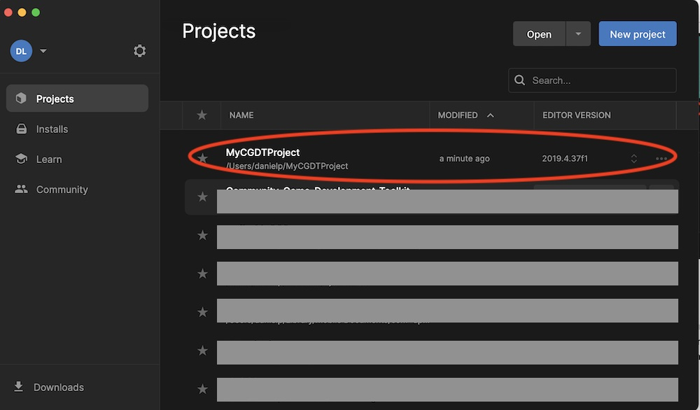

#*Get your computer and phone ready for the Dis/embodied audio-visual collage: Collective world-building workshop*

# Short Version of instructions
1. Go to [https://unity3d.com/get-unity/download](https://unity3d.com/get-unity/download) and follow directions for downloading and installing Unity. This involves installing Unity Hub, and the Unity Editor. Choose a personal, free license, and choose the most recent Long Term Release (LTR) version of the editor during the installatin process.
2. Search the app store on your phone for the Google Street View app, and install it

# Detailed Instructions

## Installing Unity
Step-by step instructions for installing and registering the Unity game engine, which we will use in the workshop

### Download Unity Hub

First, download Unity Hub at: [https://unity3d.com/get-unity/download](https://unity3d.com/get-unity/download). Click the Unity Hub button

Follow instructions to for installing Unity Hubs on your computer.

### Installing Unity

Once Unity Hubs has installed, you can install a version of the Unity Editor (in which we will using Unity Hubs.

Navigate to the Install tab in Unity Hubs, and click Add or Install Editor. Choose the most recent LTS (long-term release) version listed.

Finally, you must agree to the End User License Agreement. Once you do, Unity will begin to install. 
 

### Activating a License

Create a Unity ID by visiting the Unity ID website: [https://id.unity.com/en/account/edit](https://id.unity.com/en/account/edit). Open Unity Hubs and sign in with your Unity ID.  Once you've logged, in, click on the settings icon in the top right corner and go to the License Management tab.

Click Activate New License and then choose the Unity Personal License, which is free.

## Create a 3D project

### Setup

1. Open Unity Hub, click the New Project Button
1. Select the 3D template (circled on left)
2. Type a descriptive project name (top right circle)
3. IMPORTANT -- choose a location to save your project (bottom right circle). This should be on your computer's hard drive or an external hard drive. It should not be in iCloud or other networked drive where files are automatically loaded and unloaded onto your disk -- this will cause errors and unexpected behavior.
4. Click 'Create Project'
5. Your project will be created, added to Unity Hub, and opened in Unity

### Opening to your project from Unity Hub

Open Unity Hubs, click the project you want to open. In the example above the project was called MyCGDTProject

## Installing the Toolkit

If you'd like to fool around with the toolkit before the workshop, go [here](https://danielp73.github.io/Community-Game-Development-Toolkit/ImportToolkit.html) for instructions on how to install it.

Note, we may reinstall the toolkit at the beginning of the workshop so that we all have the most updated version. 

## Install the Google Street View app for taking 360-degree photos

Search for the app on your app store, and install it on your phone.

Note: We will not be uploading content to Google during this workshop. We will just use the app to create 360-degree photo spheres and share locally with our own computers / devices.

