[⬅️ back home](intro.html)

# Creating drawings and sketches for use in your project

## Start by making a drawing

### Crayons are fun!

Make a drawing and take a photo of it. Try to take photo with even background light. Better yet, scan your drawing. Here is an example:

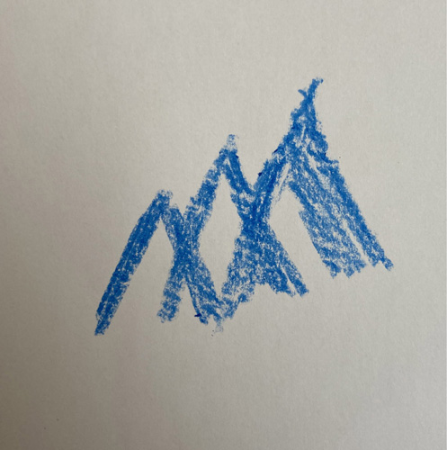

### Open in Photoshop

- Open your image in Photoshop
- Crop using the Crop Tool:

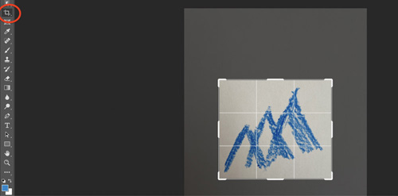

- Double click Background Layer to turn it into a regular Layer.

Before: 

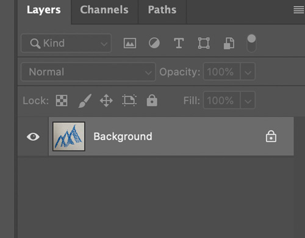

 After:
 

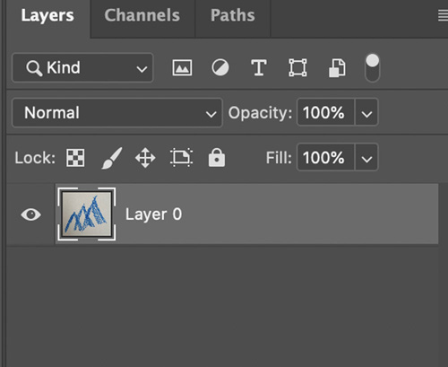

### Adjusting your image in Photoshop to make it easier to make a selection

Open your image, and from the menu bar choose Image -> Adjustments -> Levels. Fool around with these markers to make your drawing stand out from the background:

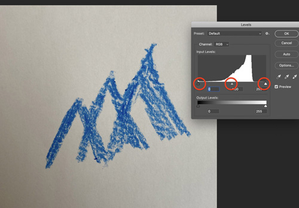

Usually it helps to move the right most marker inwards to make bright parts brighter, and the middle marker to the left to increase contrast:

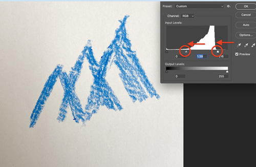

### Make a selection using the Color Range Tool

- From menu bar choose Select -> Color Range. 
- Check ‘Invert’
- Use the eye dropper tool to click in your drawing. 
- The black areas in the previews are your selection
- Try clicking on different locations to see what creates the best result. Also fool around with the Fuzziness slider.
- When done, press OK. (now, the background will be selected--you’ll see why in a minute)

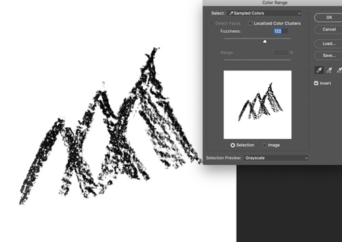

Now you should have something that looks like this, showing your selection:

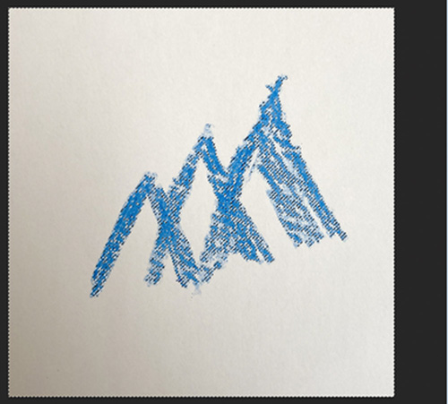

Press delete to delete the selected background. You should see checkerboard background, indicating transparent areas:

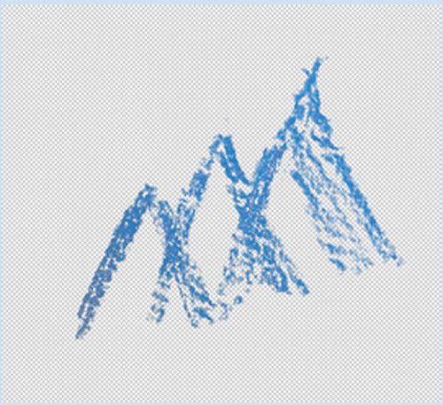

### Saving as a Transparent PNG

- In the menu bar go to Image -> Image Size. Make your image about 1500 pixels in the maximum dimension.
- Go to File -> Export -> Quick Export as PNG. Make sure to give your file a recognizable name, and take note of where you save it on your computer.

## If you have a multicolor drawing

Example:

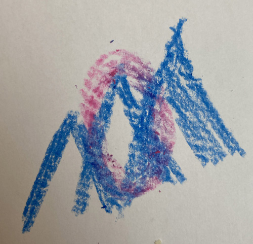

- In the selection step with the Color Range tool, don’t click the Invert check box. 
- Then click on the image’s background to select the background:

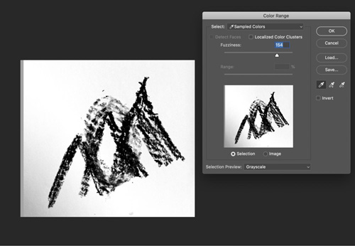

- Adjust where you click and the fuzziness slider. 
- When finished, press OK, and then delete background. Complete rest of steps using the same process.

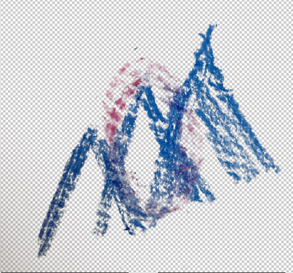

## Saving as a Transparent PNG

- In the menubar go to Image -> Image Size. Make your image about 1500 pixels in the maximum dimension.
- Go to File -> Export -> Quick Export as PNG.
- Find your Unity project folder, and navigate to Assets->Drawings inside that folder. Save your PNG at that location.

## Add the photo to your CGDT Unity project
- Make sure your CGDT project is open
- In the Project panel in your Unity project, navigate to the Drawings folder. Drag your PNG to that folder in the Project panel. 
- Drag it into your scene! 

<!---- begin statcounter ---->

<noscript>

    

</noscript>
<!-- end statcounter -->