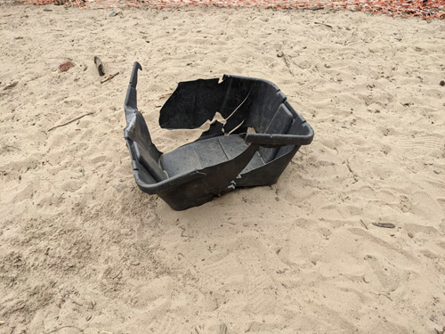
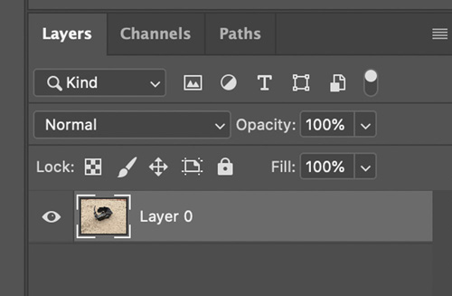
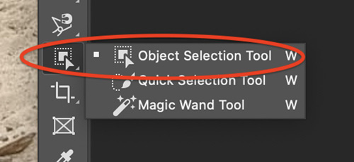
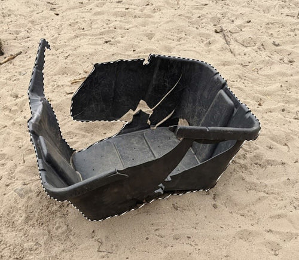
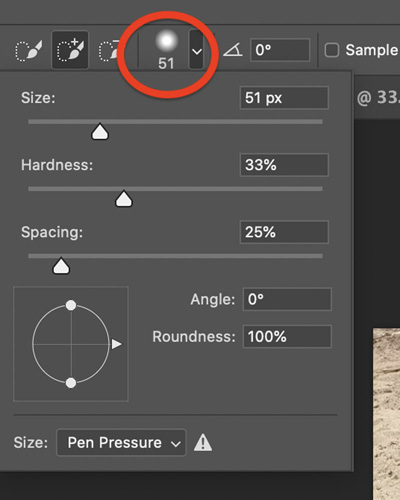
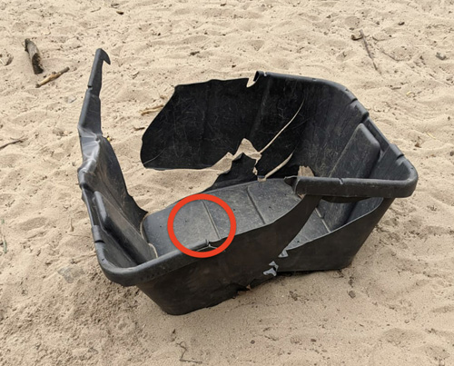
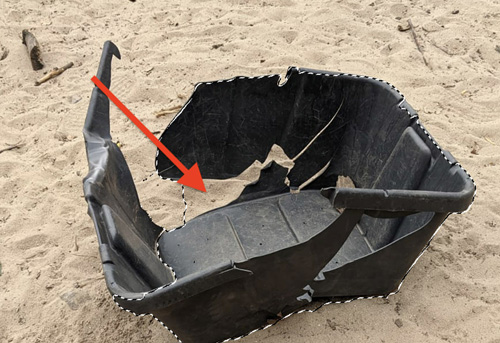

[⬅️ back home](intro.html)

# Creating Artwork - Photo Cutouts using your own photos or found photos

### Cropping objects out of images

Example (it’s easiest if your object stands out from the background):

- Following same steps as above, double click background layer to turn into a regular layer:

### Option 1: Using object selection tool

- Drag over the object and see if Photoshop selects what you want it to. In this case it did:

### Option 2: Using Quick Selection Tool

- Adjust the brush size in this menu bar. Experiment so that brush is similar size, but a bit smaller than the shapes in your object

This is a good size to select the main portion of this object:

For smaller sections of object, you can make the selection brush smaller.

### Removing from selected area

For example, if you select this sand area:

Press the option (or alt if you are on windows) key while selecting the areas you would like to remove from your selection. 

### Now: Once your finished making your selection

Now in the menubar go to Selection -> Inverse to select background. Delete the background to leaves transparency around the object:

## Saving as a Transparent PNG

- In the menubar go to Image -> Image Size. Make your image about 1500 pixels in the maximum dimension.
- Go to File -> Export -> Quick Export as PNG. Save the file to your computer in a recognizable location.

## Add the photo to your CGDT Unity project
- Make sure your CGDT project is open
- In the Project panel in your Unity project, navigate to the Photos folder. Drag your PNG to that folder in the Project panel. 
- Drag it into your scene! 

<!---- begin statcounter ---->

<noscript>

    

</noscript>
<!-- end statcounter -->