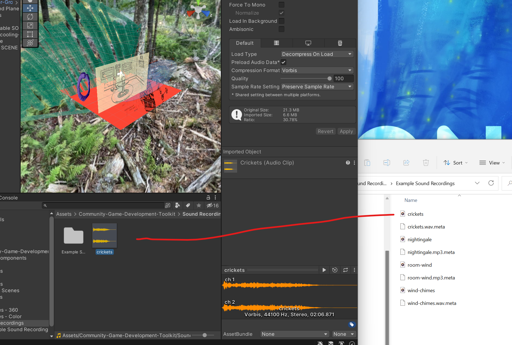
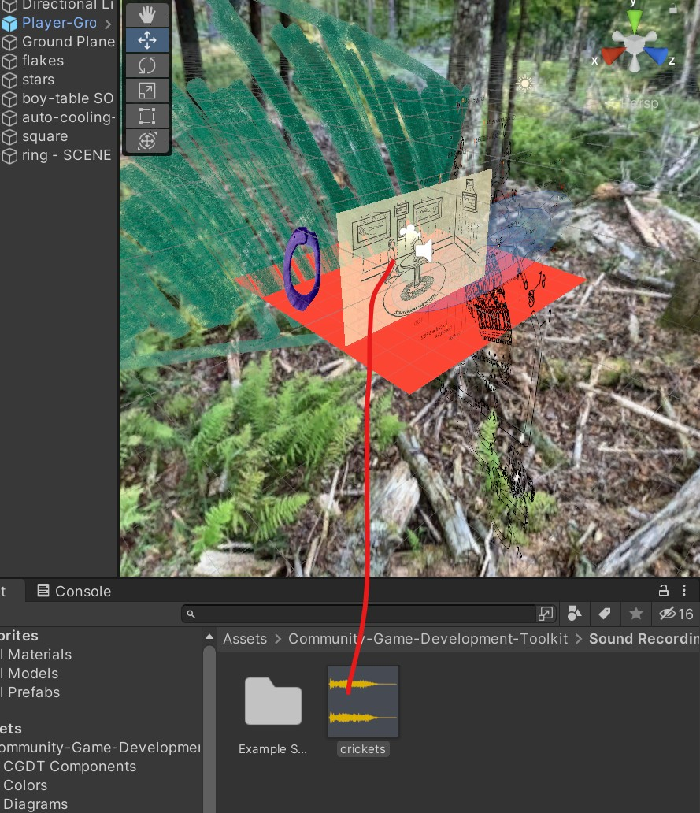

#Adding Sound Recordings to Your Project

## Record your own, or find sound recordings

### Option 1: Record sounds using your phone

#### iPhone
1. Use the Voice Memo app to record a sound
2. Share the sound to your computer using Airdrop, or via Google Drive or other service
3. Convert the sound to an MP3 using a website such as [Convertio](https://convertio.co/audio-converter/)

### Android
Instructions coming soon.

### Option 2: Find freely available sound recordings on the internet
1. [freesound](https://freesound.org/) is a great resource for field recordings
2. If you download a large WAV file, conver it to an MP3 using a service such as [Convertio](https://convertio.co/audio-converter/)

##Add the sound to your project
1. Drag the sound file to the Sound Recordings folder in your project

2. Drag the resulting sound file to an object in your scene

That's it!

<!---- begin statcounter ---->

<noscript>

    

</noscript>
<!-- end statcounter -->