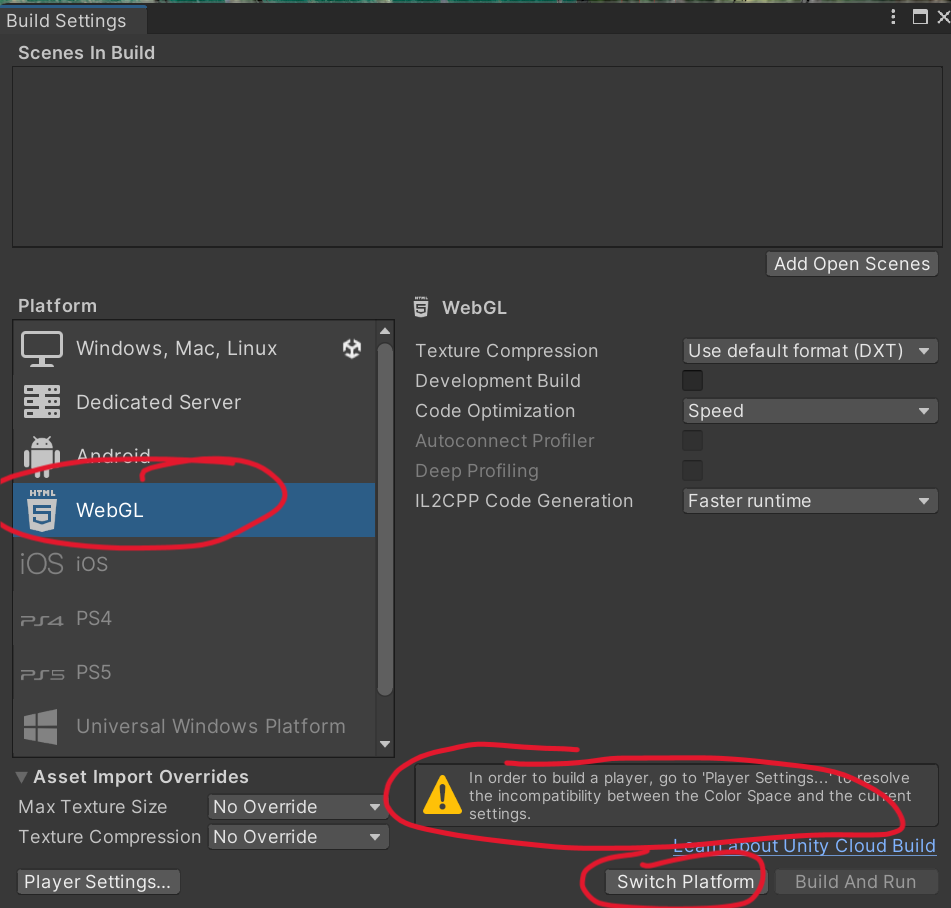
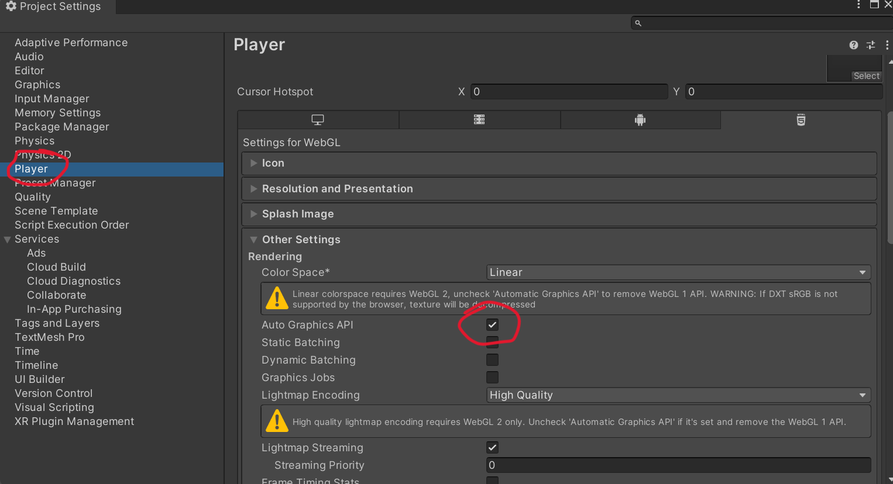

# Exporting your project to itch.io

## Switch your project to WebGL platform

1. Open File -> Build Settings
2. Choose the WebGL platform and click the "Switch Platform" button. Wait several minutes if necessary.
3. If you see the error "In order to build a player, go to 'Player Settings...' continue to next step. Otherwise skip next step.

## Fix error in Player settings

1. Go to Edit -> Project Settings
2. Click 'Player' in the left menu
3. On the right, in 'Other Settings' uncheck 'Auto Graphics API'. The warnings should go away.

## Build and Run your project in WebGl
1. Open File -> Build Settings again
2. Press the 'Build and Run' button. Choose a place to save your project. I usually save it in a folder called Build in my project folder.
3. Wait a few minutes
3. Check that your browser opens with a working version of your project. 
*Note: click your mouse inside the game window in order to use the mouse properly while you're playing.*
4. Find the location of your build. Mine is in my project folder, in a folder called 'Builds'. You'll need to locate these files for the next step.
*Note: if you open the index.html file in your Builds folder to open it in a browser, the game may not play. It needs to be run by a local server. You can click 'Build and Run' in Unity to run it again.*

## Get the project ready for Itch
1. Find the Build folder in your project folder
2. Zip that whole folder (on Windows, right click the folder and choose Compress to Zip File. On Mac, right click on the folder and choose Compress)

## Go to http://www.itch.io
1. Make an account if you don't have one.
2. Go to your account dashboard (top left of browswer window)
3. Click 'Create New Project', red button 
4. Enter a title
5. For Kind of Project choose HTML
6. For pricing you can choose No Payments (unless you want payments)
7. In the uploads section, choose Upload Files. Select your zipped Build folder and upload it.
8. Once it uploads, check 'This file will be played in the browser'
9. For Embed Options, you can enter a size to set a size for your embedded game. Or you can leave it unchanged.
10. Click Save and View Page at the bottom

