# Collective world-building workshop: Dis/embodied audio-visual collage (asynchronous)

*Collectively composed virtual scene from the Museums Without Walls Conference, Museu sem Paredes / Queens University*

## Introduction to the workshop
In this asyncrhonous workshop, participants will work together to produce a series of interactive, virtual 3D environments composed of photographic fragments, drawn sketches, audio recordings and phone-based 3D scans of participants' immediate shared, embodied surroundings. Over the course of the workshop, we will use our phones to capture audio, 2D and 3D scan-based source material and compose these materials into a 3D scene using the Unity game engine and the Community Game Development Toolkit (see below). We will take a collage-based approach, composing a collection of audio-visual traces of participants bodies, clothing, belongings, and the physical surroundings into a visually abstract scene that presents a hybrid embodied / disembodied experience of collective social, cultural and physical space.

## The Community Game Development Toolkit - What is it?
The Community Game Development Toolkit is a set of tools that make it easy and fun for students, artists, researchers and community members to create their own visually rich, interactive 3D environments and story-based games without the use of coding or other specialized game-design skills. Building on the popular 3D game design engine Unity, the toolkit provides intuitive tools for diverse communities to represent their own traditions, rituals and heritages through interactive, visual storytelling. Projects can be built for desktop, mobile and VR applications.

For more information, see the Community Game Development Toolkit [webpage](https://danielp73.github.io/Community-Game-Development-Toolkit/).

## How will the workshop work?
Over the course of the conference, you are invited to contribute content that can be used to create a shared virtual scene. This can mean several things, depending on how you want to engage. You can contribute simply by submitting a photo of an object, person or space, or making a simple audio recording of your environment. You can also contribute by making a sketch, drawing or painting of an object or space. Finally you can use your phone to create a 3D scan of objects or envrionments. Contributions will be visible to all workshop participants, and to the public.

As a more advanced form of participation, you can download Unity, install the toolkit, and create your own collage-based virtual scene using material contributed by all participants. Towards the conclusion of the conference I (Dan Lichtman) will also make a virtual world using contributed material. All shared virtual worlds will be shared on a website at (or soon after) the conclusion of the workshop.

Find instructions for each of these possibilities below.

`ADD GOALS AND CONTEXT SO THE PROCESS MAKES SENSE`

## How to contribute material

All material can be submitted using [this form](https://forms.gle/JncAuAfQaw3dW97F7). 
Previously submitted material can be viewed [here](https://drive.google.com/drive/folders/1wAzfkEtvsvGgM4FBQJukqiC0XhdmFquC3bNrOalB1XUKSfaJlxuHmWtY4yRjTLXqwqPAKaDe?usp=drive_link)

##### Submit a photo
Take a photo of an object, person or environment with your phone, and submit it! Suggestions: An interesting object in your bag; something strange you found in your accomdation or at Pratt; something important to you; a noteworthy creature you encountered; a body part. I will format any photos for use in the scene (mainly, removing the background)

##### Submit a photo, and format it yourself
See above, but remove the backgroud yourself to prepare it for use in the scene. An easy way to do this is to use the website https://www.remove.bg/. Upload your photo to the website, download the result and upload it via the form.  For more control over the process using Photoshop, follow directions here: https://danielp73.github.io/Community-Game-Development-Toolkit/CreatingArtwork-Photos.html

##### Submit an audio recording
Use the Voice Memos app (iPhone) or Voice Recorder app (Android) to record sounds from your environment. Suggestions: the street outside your accomdation; sound of the hallways between conference sessions; the sound of birds and other animals on campus; the sound of the TV nextdoor; music from a passing car. Once you've recorded the sound, save to your phone and upload via the form.

##### Make a sketch, drawing or painting
You don't have to be good at drawing or painting! Suggestions: sketch, draw or paint a piece of furniture, an article of clothing, a body part, your colleague or friend; a building. Suggestion: use a tool that makes thick lines: crayon; wide marker; big paintbrush. You can remove the background to maek a transparent image using the website https://www.remove.bg/. Or for a more controlled approach, follow directions [here](https://danielp73.github.io/Community-Game-Development-Toolkit/CreatingArtwork-Drawings.html).

##### FUN: Make a 3D scan of a space or object
Download the Polycam app on your device. 

##### Advanced: Make your own scene!
Follow instructions to install toolkit and make your own scene.

## How final results will be shared

## Things you can do with the toolkit

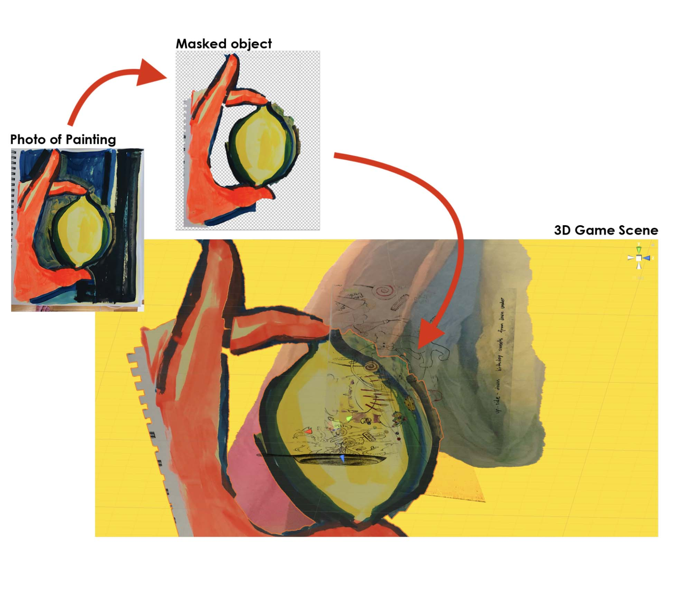

* Use your own drawings, paintings and cuts out from photos to create 3D scenes
* Intuitively drag and drop drawings, paintings and photo cut outs into scenes -- toolkit automatically formats images
* Use transparency in drawings, paintings and photo cut outs to easily create rich, organic visual composition in 3D space
* Take your own 360-degree photos and use as interactive, photogarphic backgrounds to your scenes
* Use a flying player (moves freely through 3D space) or a grounded player (moves along a ground plane in the scene) to interact with your scenes
* Create Scene Change elements -- when the player moves through specified visual elements, they are transported to another scene. Simply designate an element as a scene change, and select the scene the player should be transported to
* Use scene changes to create interactive visual narrative

## Coming soon

* VR pipeline for Meta Quest 2
* Use video/moving image textures
* Interactive text
* Simple animated materials
* Title screens and pause screens

* And more...

## Long Term Goals

* Arrange and compose visual assets in an interactive game mode rather than in the Unity Editor
* Create scene changes in an interactive game mode
* --> provide workflow for avoiding the use of the Untiy environment all together
* Arrange and compose scenes in VR
* Create web-based database of projects created using the toolkit

## Examples
### The Raisin Truck Makes Raisins

by Daniel Lichtman with contributions Ian Giles, Helena Haimes, James Prevett, David Baumflek and Johann Arens.

A collaboratively produced interactive 3D environment that uses collage, abstraction and spatial orientation/disorientation to reflect on the experience of caring for young children during pandemic and lockdown.

[More Info](https://www.daniellichtman.com/raisintruck/)

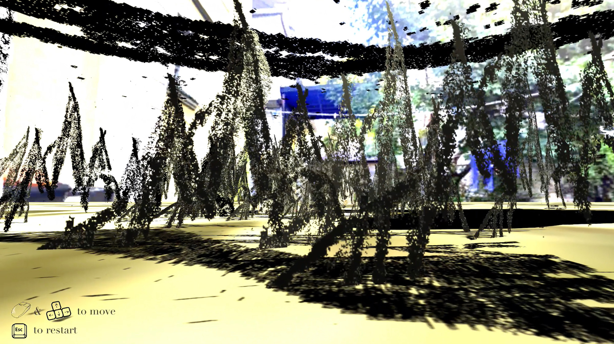
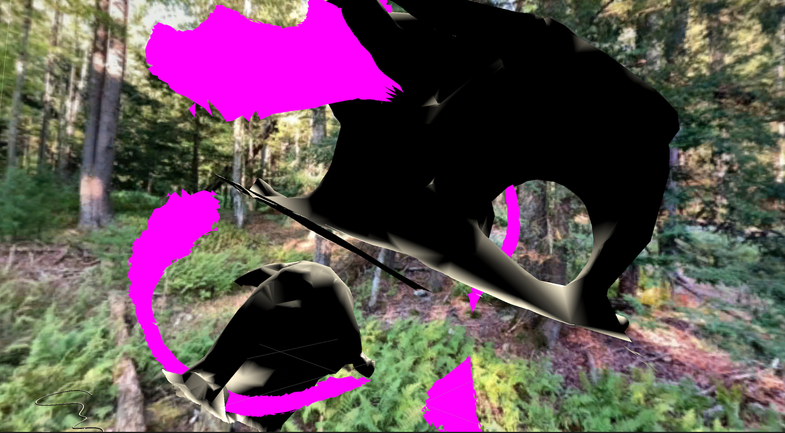

### MetaEternity

By Teresa Braun, Ayodamola Okunseinde, June Bee, and Zelong Li

Toolkit used as part of a VR and performance installation at Practice Gallery, Philadelphia

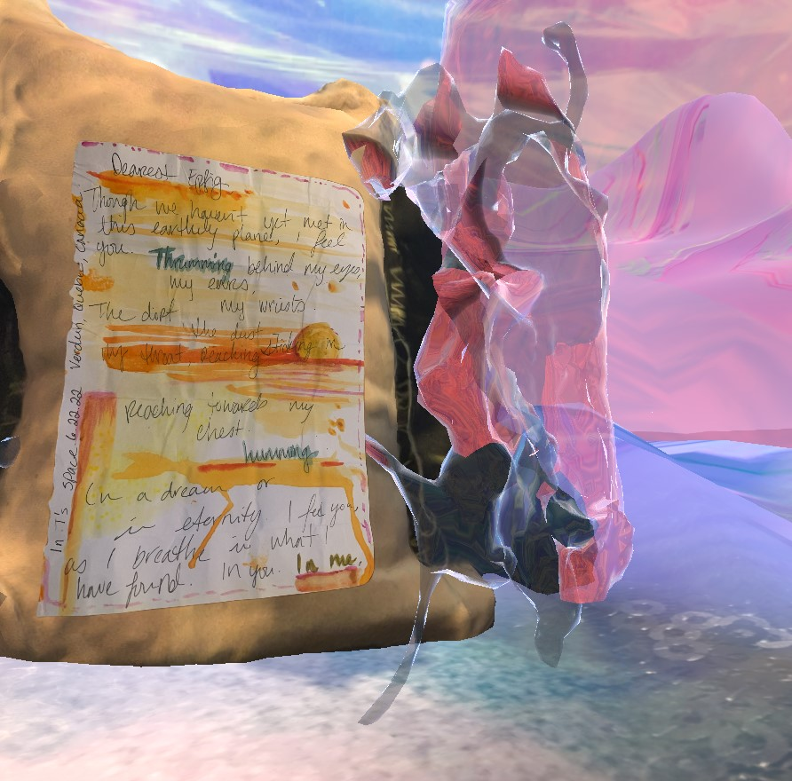
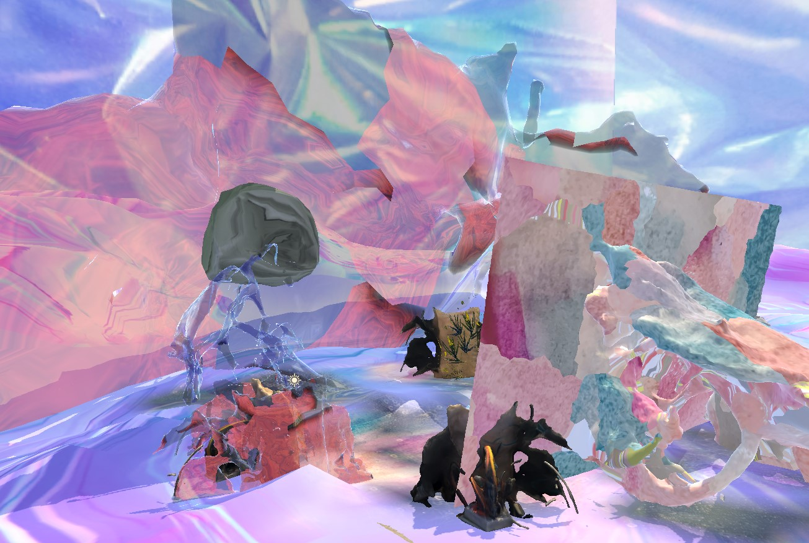
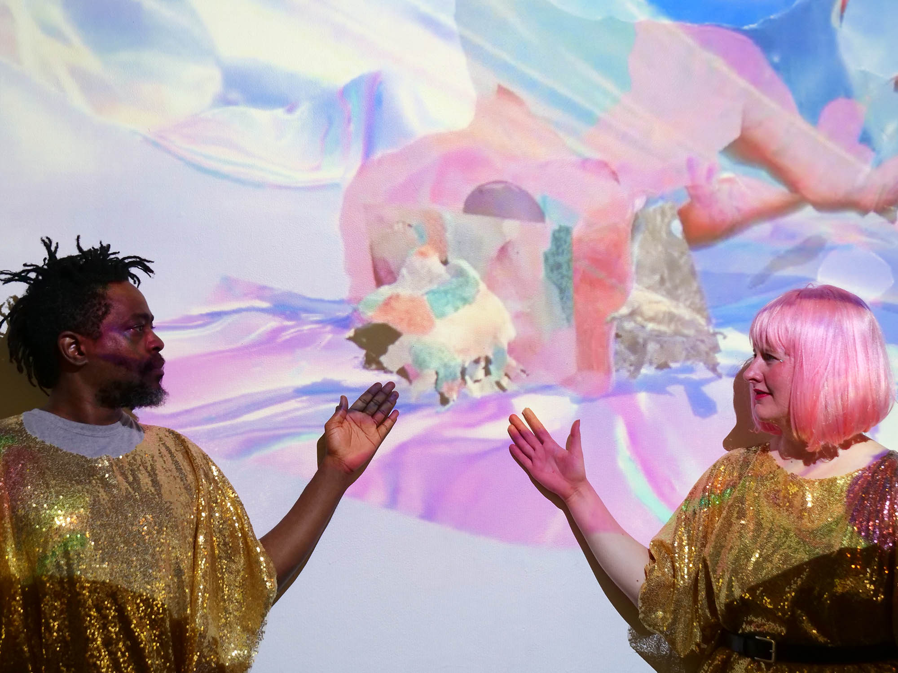

### Collaborative Worldbuilding workshop at Museums Without Walls Conference, Museu sem Paredes / Queens University, 2022

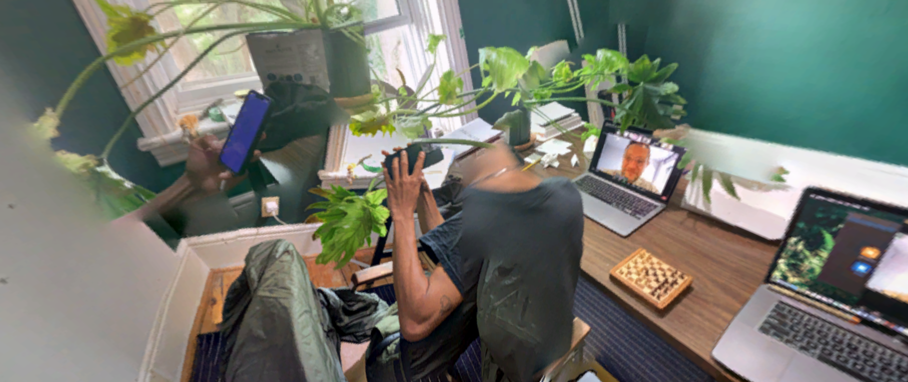
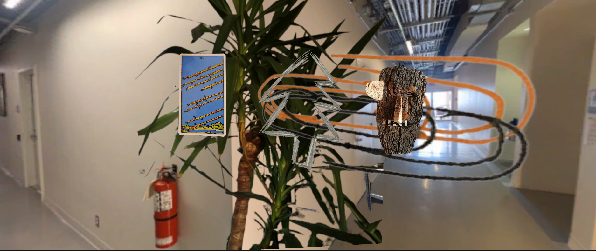

### Collaborative Worldbuilding workshop at the Society for Language, Science and Art at Purdue University, 2022

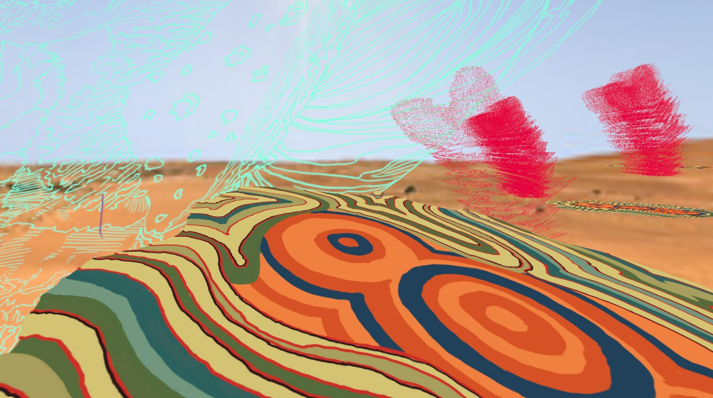
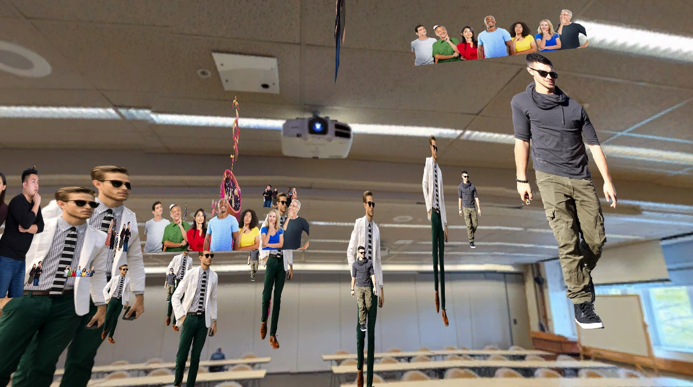
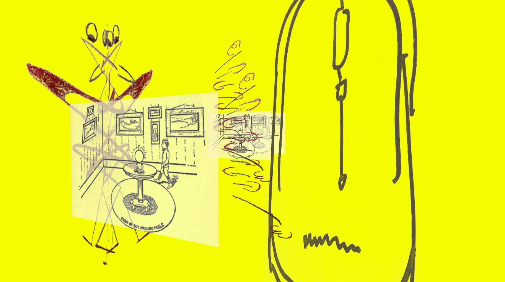

## Context

The toolkit is being developed as part of the NSF-funded VR-REU program in immersive visualization and virtual/augmented/mixed reality at the Visualization and Virtual Reality Lab at Hunter College, used in the MetaEternity project listed above, taught in games courses at Baruch College, CUNY and other CUNY campuses, plays a consulting role in the Ant Farm Art Building Creative Preservation Initiative (AFAAB) at Antioch College and has been featured in workshops at universities and institutions across the country.

The toolkit has been presented at numerous conferences, workshops and exhibitions including iDMAa at Winona State University (2021, 2022), SLSA at Purdue University (2021, 2022), Museums Without Walls at the Museu sem Parades (2022) the Show Don't Tell Symposium at Culture Push (2021) and the New Media Caucus Showcase at the College Art Association Conference (2021)

## How to use the toolkit
[Go to How To page](howto.md)

## Get involved / questions / contact
Contact Daniel Lichtman at daniel.lichtman at stockton dot edu.

<!---- begin statcounter ---->

<noscript>

    

</noscript>
<!-- end statcounter -->
 

