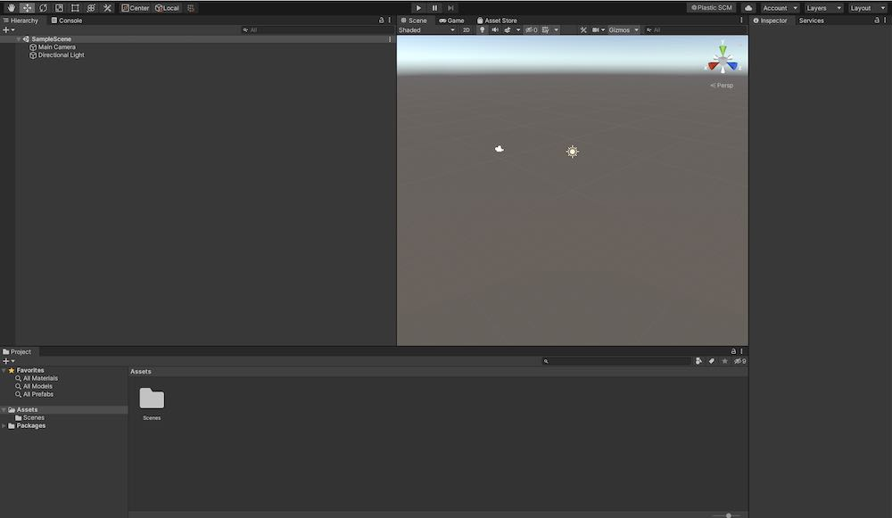

## Importing the Community Game Development Toolkit into your project

1. Download the toolkit [here](download.md). Unzip the download.
2. Find the unzipped folder on your computer. It is probably in your downloads folder. 
3. If it's not open already, open the new project you created using Unity Hub.
4. An empty project should look like this:

1. 

<!---- begin statcounter ---->

<noscript>

    

</noscript>
<!-- end statcounter -->