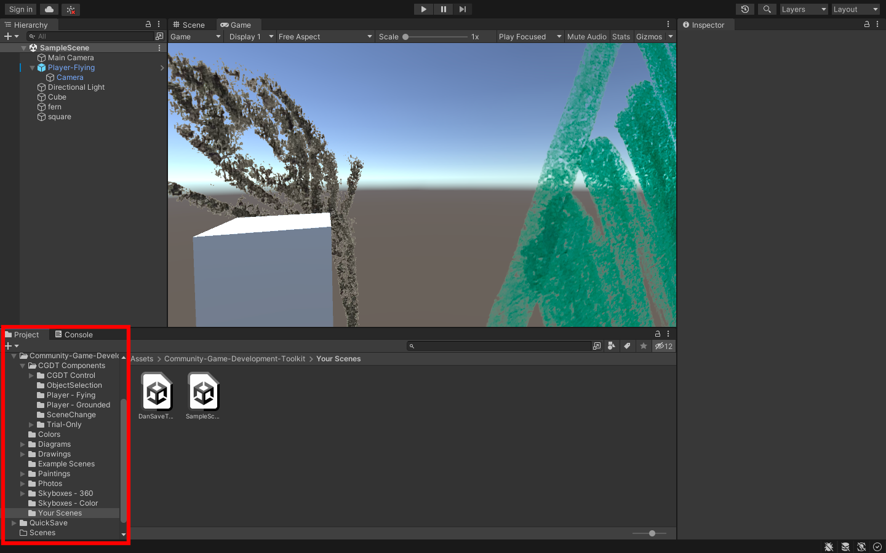
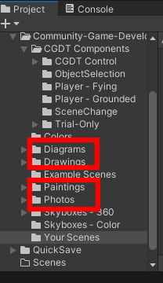
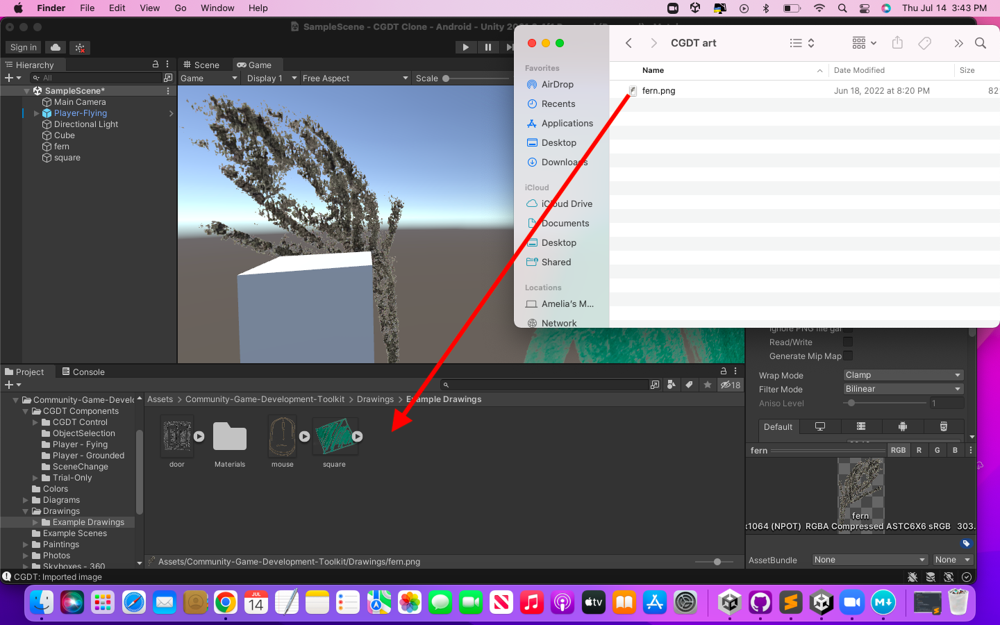

# Importing Assets into Unity

Hopefully, before reading this tutorial, you've already gone through and understood how to create drawings, sketches, paintings and photos. If not, please go and read those tutorials first! This tutorial will **not** be explaining how to translate real-life art to the virtual world. Instead, it's going to explain how to add these new virtual art pieces to your project in Unity. 

Okay! Assuming you've saved your art somewhere easy to find in your computer, the first step is opening your CGDT project in Unity Hubs. Looking at the project panel in your Unity project, you'll see several folders. 

Navigate to the folder that makes the most sense for the type of art you'd like to import. Our recommendations would be diagrams, drawings, paintings, or photos. 

Then, drag and drop your file into that folder.

It will then appear in that folder, and that's it! It can now be dragged into the scene to be used as many times as you'd like.

