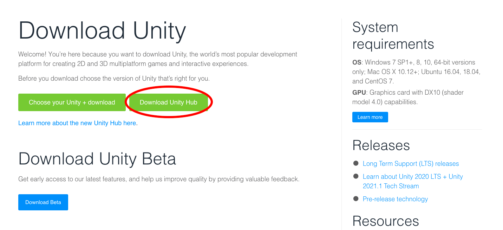
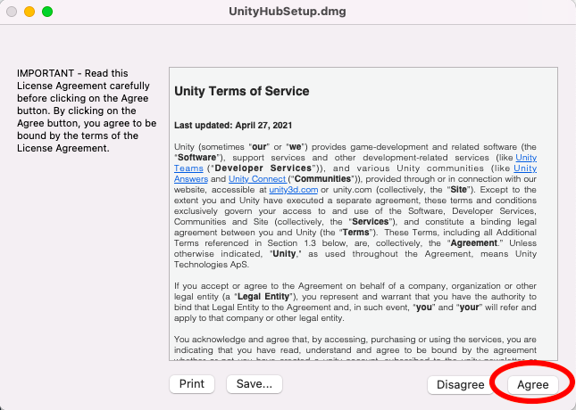
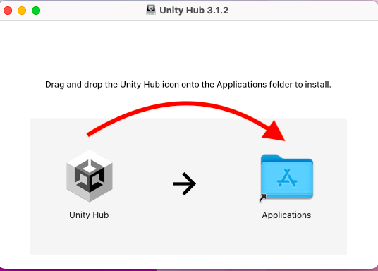
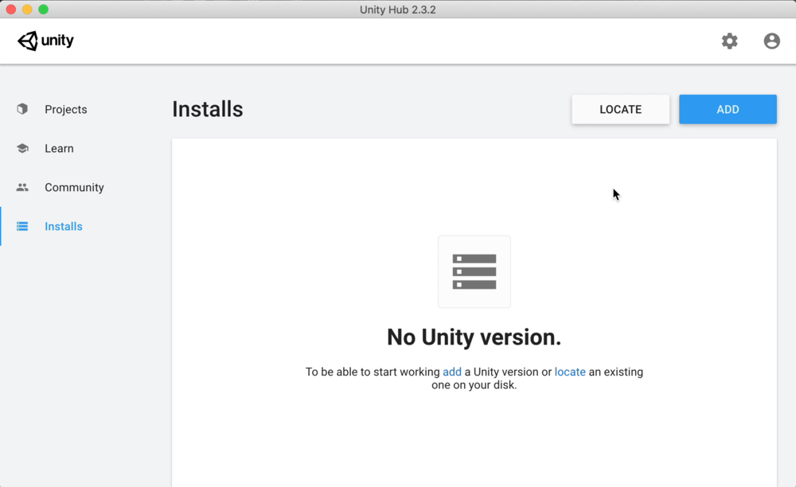
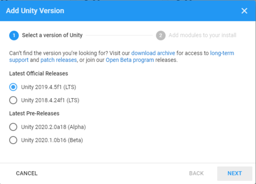
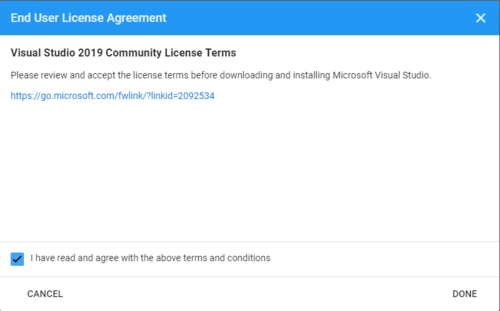
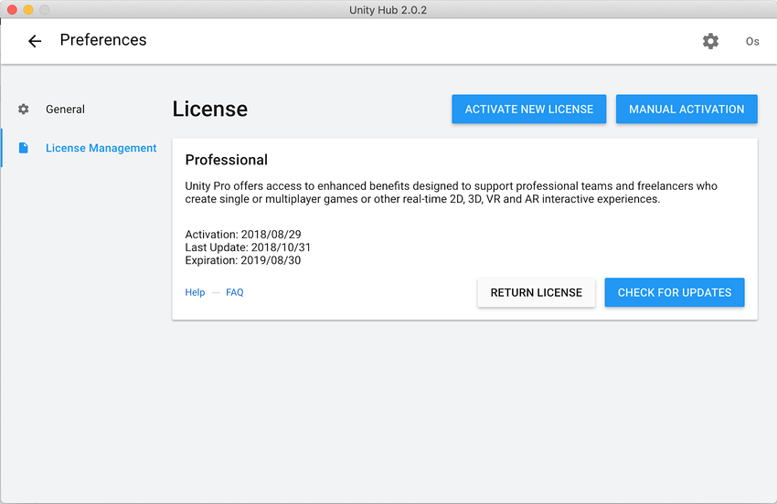
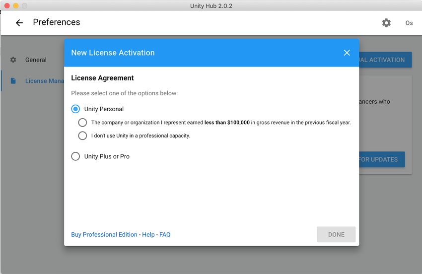

# Installing Unity
Before you can begin using the Community Game Development Toolkit, you must download Unity. This tutorial will provide you with step by step instructions. This tutorial is geared towards Mac users, but installing on Windows is a very similar process.

### Downloading Unity

First, download Unity at: [https://unity3d.com/get-unity/download](https://unity3d.com/get-unity/download). Click on Unity Hubs, the free version of Unity.

### Installing Unity Hubs

Next, open up the file you just downloaded. You should see a screen like this:

Click agree, and then drag and drop the Unity Hub icon into the Applications folder.

### Installing Unity

Once Unity Hubs has installed, you can install a version of the Unity Editor (in which we will using Unity Hubs.

Navigate to the Install tab in Unity Hubs, and click Add or Install Editor. You will be given a choice of versions; usually the latest Long Term Release, or LTS version is best.

Finally, you must agree to the End User License Agreement. Once you do, Unity will begin to install. 

### Activating Your License

To use Unity, you must have a license. You can create a Unity ID by visiting the Unity ID website: [https://id.unity.com/en/account/edit](https://id.unity.com/en/account/edit). Open Unity Hubs and sign in with your Unity ID.  Once you've logged, in, click on the settings icon in the top right corner and go to the License Management tab.

Click Activate New License and then choose which type of license you'd like to activate. Unless you are a professional game developer, choose the Unity Personal License, which is free.

