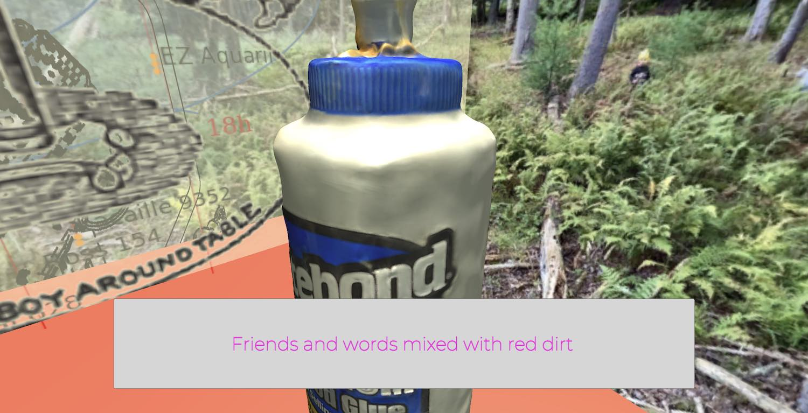
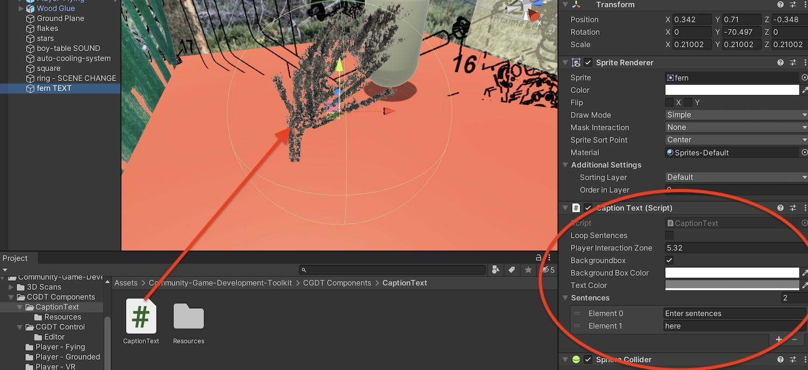
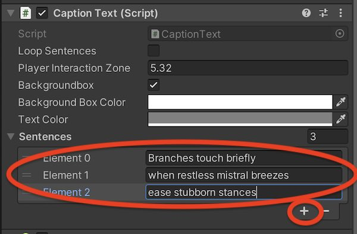
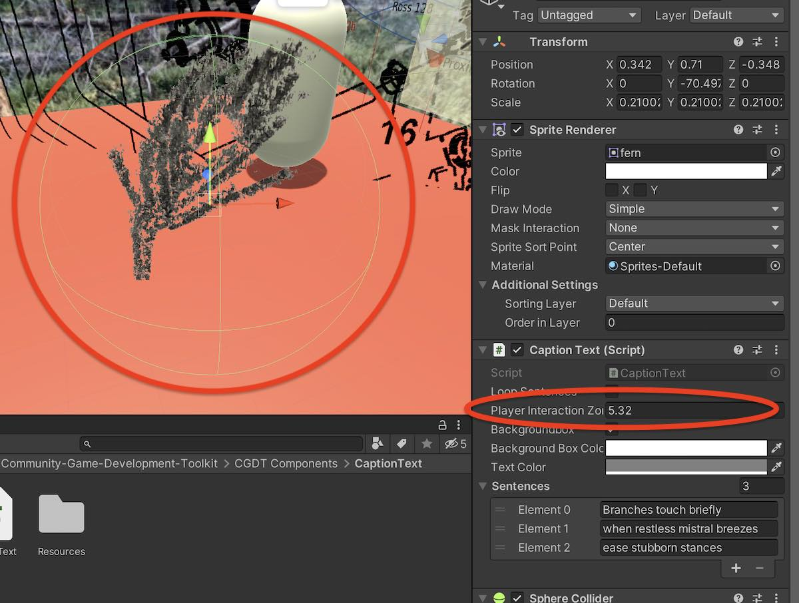
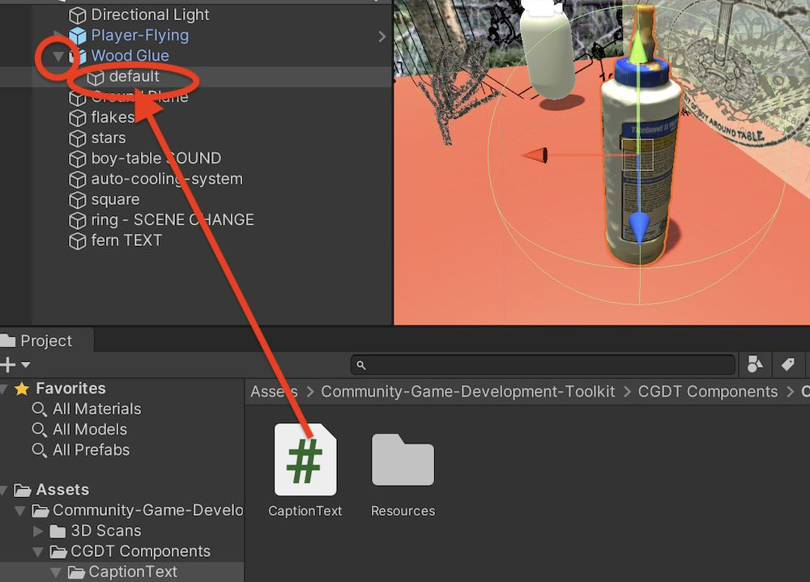

# Adding Interactive Text

Using the Interactive Text component adds a text caption to objects that appears when the player is close to the object. You can click through sentences or phrases of text, which then either disappear after the last phrase, or loop back to the beginning.

 
## Steps for creating interactive text:

* Put you object (drawing, painting, photo, 3D scan, anything) in the scene.
* Find the CaptionText file in the CGDT Components -> Caption Text folder.
* Drag it onto the object in the scene, or drag it onto the object's name in the hierarchy panel. If this was successful, the Caption Text component should show up in the inspector:

* In the inspector, type the sentences or phrases that you would like to appear in the 'Sentences' section. To add another sentences, click the plus button:

## Formatting the caption text

* Right above where you add sentences, choose whether to show a colored box behind the text, choose the color of the box, and choose the text color (or leave them as default).
* If you want sentences to loop after the player clicks through, check 'Loop'. If you want the captions to disappaer leave it unchecked. They will always reappear if the player moves away from the object and approaches it again.

## Adjusting the size of the interaction area

Caption text appears when the player approaches the object. To adjust how close the player has to come to the object:

* Adjust Player Interaction Zone. To do this, you can click on the words 'Player Interaction Zone' in the inspector, and drag your mouse left or right. 
* Watch the green sphere around the object in the scene view -- it will grow and shrink as you change the value, indicating how big the area is. Experiment in play mode to get the kind of interactivity you want. 

## Note about adding text to 3D Scans

The component works best if you follow these steps:

* Find the 3D Scan object in the Hierarchy.
* Click the small gray triangle to expose objects nested inside your scan
* Drag the Caption Text component to the object inside, often called 'default'. See below:

