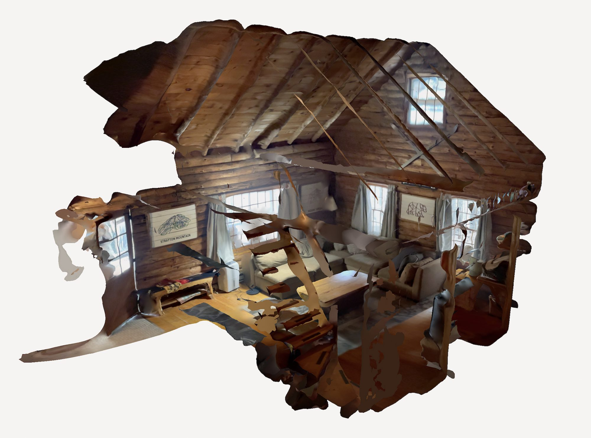
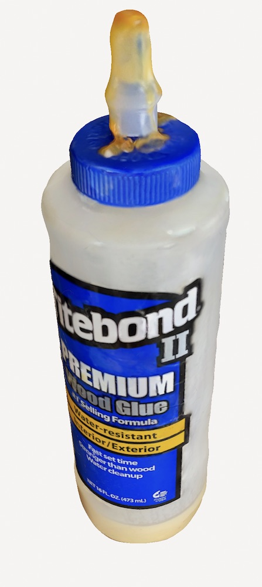
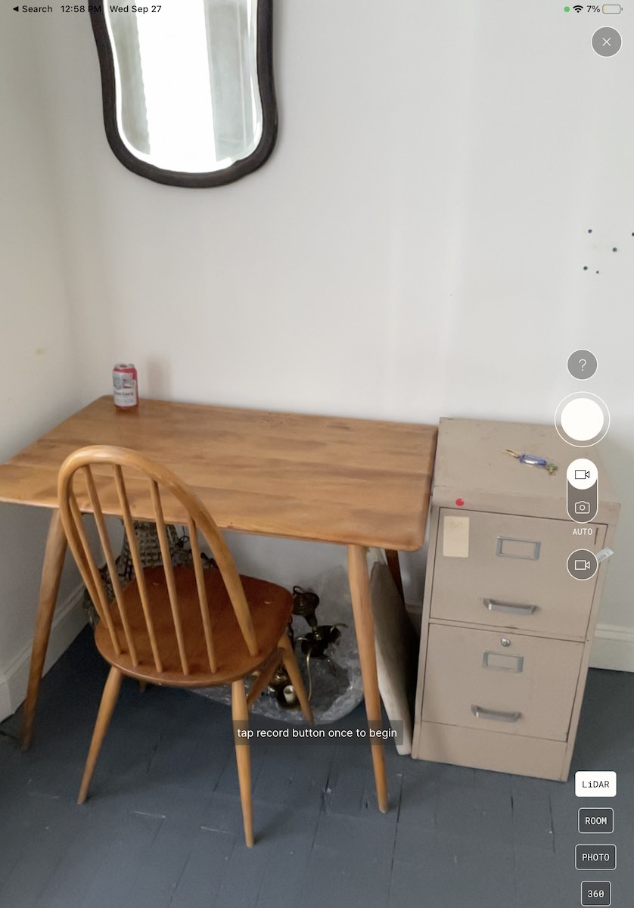
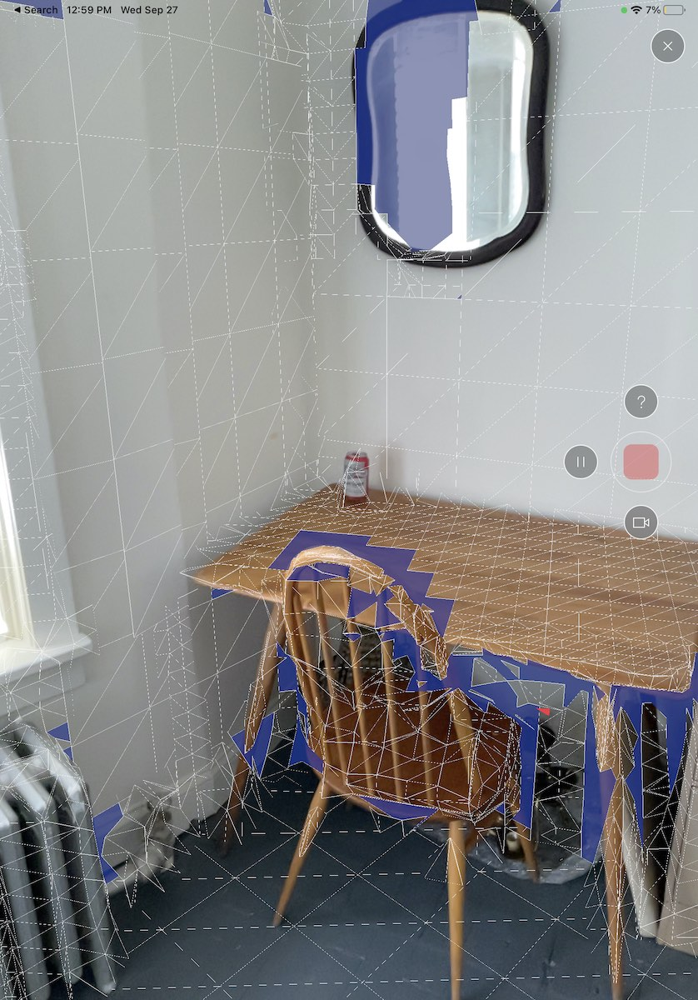
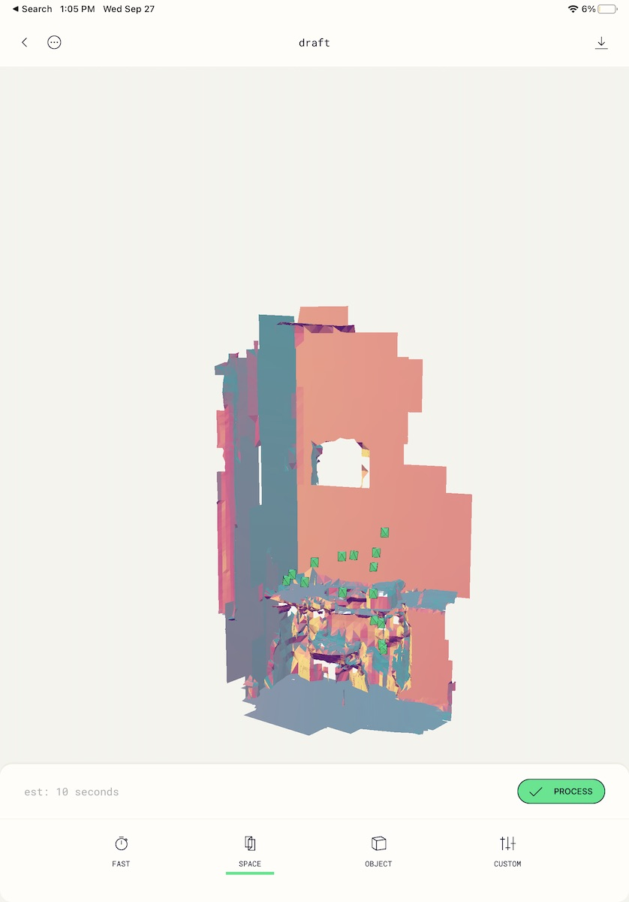
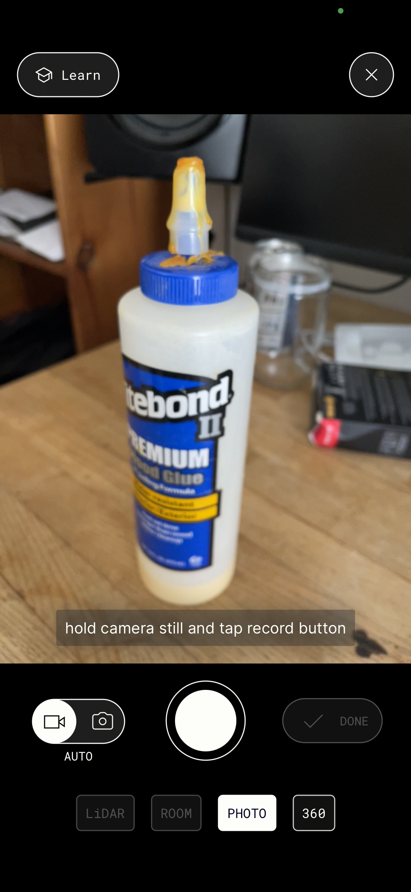
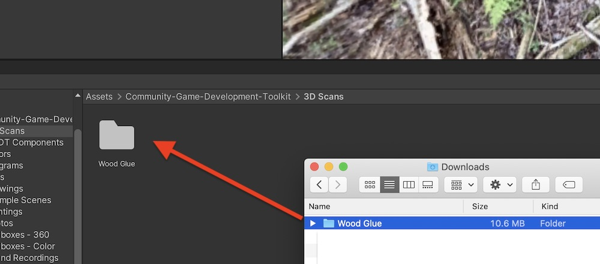
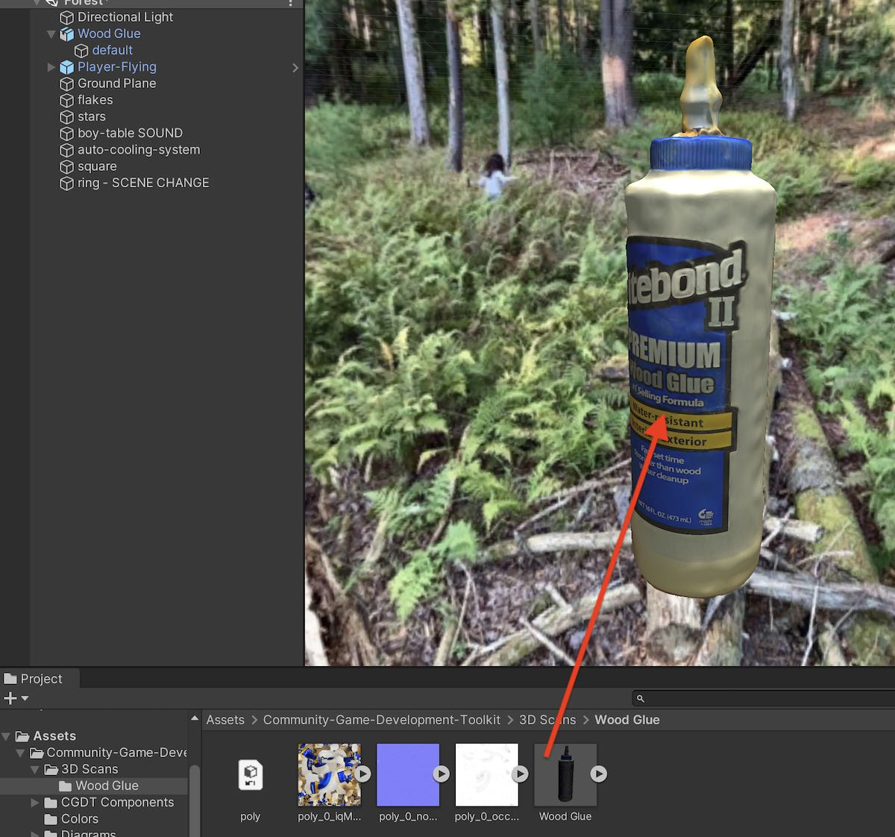
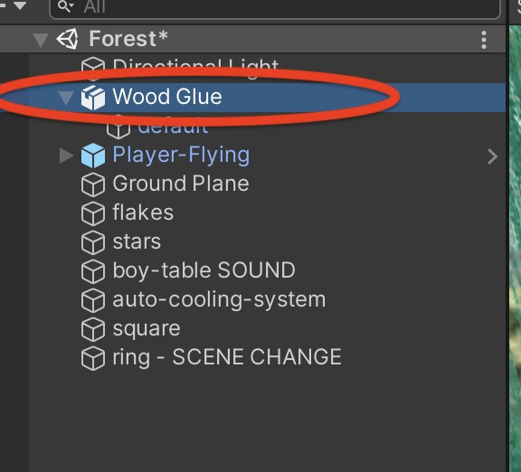
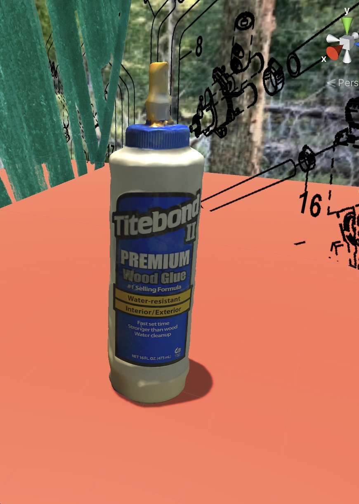

[⬅️ back home](intro.html)

# Make Your Own 3D Scans with Polycam

## Introduction

Polycam is an app for iPhone, iPad and other devices for making 3D scans of individual objects as well as room-sized spaces. Unfortunately a Pro account (paid) is required because the free Polycam account does not allow you to download 3D scans in a format that Unity recognizes. 

## LiDAR Scans

If you have an iPhone or iPad pro, or other device with a LiDAR scanner, you can use the LiDAR scan mode to make a room sized scan. Here is an example scan of the interior of a log cabin. This scan was taken in a few minutes with an iPad Pro.

## Photo-based Scans

You can use Polycam on any device to create a photo-based scan. In this mode, Polycam helps you take a photo of an object from a variety of angles and then uses AI software to create a 3D model using those photos. Here is an example scan of a bottle of wood glue.

## Setting up Polycam

Download the Polycam app and make an account. Pay for a Pro account if you wish.

## Taking a LiDAR scan of a larger object or room-sized space.
- In the polycam app, touch the + button on the screen to create a new scan.
- Choose LiDAR mode, and choose the Auto setting. See this screenshot:

- Press the large record button, and move your device around the room. The screen will display a mesh around the surfaces:

- The shaded areas are areas not yet scanned. The idea is to move the device around so that all the shading disappears. Try to get around, above, and below all areas. The slower, and more carefully you move the camera, the clearer your result will be.
- When you're done, press the record button again to stop. You'll get a preview of the scan that looks something like this:

- Press 'Process' to process the scan. 

## Taking a Photo-based scan of an object

- In the polycam app, touch the + button on the screen to create a new scan.
- Choose Photo mode, and choose the Auto setting. See this screenshot:

- Press the large record button, and move the device around the object. The app will automatically take photos. Try to face the object from all directions.
- When done taking photos, choose a detail level (medium is usually fine). Try out the 'Object Masking' setting to remove the background if you like.
- Press 'Upload' to upload the photos, and wait for them to process into a 3D model.

## Getting your scan into Unity (Photo or LiDAR)

- Visit the [Polycam website](https://poly.com) and sign in. 
- Find the scan and open it.
- Click the Download button, and choose OBJ format (if OBJ format is not available, you probably don't have a Pro account)
- Find the resulting file in your Downloads folder. It will be called 'poly'. Rename it to something meaningful. For example, 'Wood Glue'
- Drag the whole folder into the Project tab in Unity. You can put it in the 3D Scans folder in the Community-Game-Development-Toolkit folder if you like:

- Open that folder in your Project tab. The model will be colled poly.obj. Rename it if you like, to Wood Glue for example. Drag it into your scene:

 

- Often the object will import small and far away. Double click on the object in the inspector to find it and focus on it. 

 

- Use the move and scale tools to move the object into place in your scene.

 

<!---- begin statcounter ---->

<noscript>

    

</noscript>
<!-- end statcounter -->