[⬅️ back to How To](howto.md)

# Unity Basics

Once you open Unity, you'll see something like this:
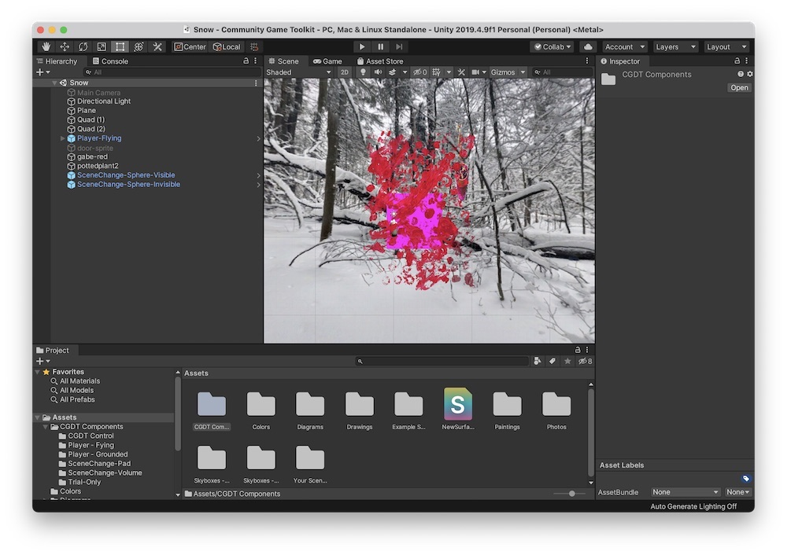

## Parts of the interface

### Project
Dispalyes assets associated with your project. Assets include image files of drawings, photos and 360-degree photos you will use in your scenes, as well as materials, scripts, and other aspects of your project that are stored as files. The tutorial will cover which assets to focus on and how you can easily manage them.

### Scene
A 3D view of the current scene that you're editing. Each scene contains a particular combination of objects, photos and drawings that you compose in 3D. During gameplay, you can control how the player moves between scenes

### Hierarchy
A list of objects and components that are in the current scene. You can click on an object's name to highlight it in the scene, and collect objects together in groups using this panel. You can rename objects to make them easier to keep track of.

### Inspector
When you click on an object in your scene, its properties will appear in the inspector. When using the Community Game Development Toolkit, you won't have to deal with most of these properties. We will have to use some of them, however, which will be indicated in the tutorial.

## Manipulating the 3D view in the Scene Panel
If a scene is not visible, open one of the example scenes by clicking on the Example Scenes folder in the Projects tab. Double click one of the scenes to open it in the Scene panel.

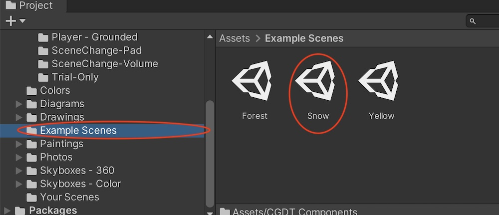

### Hand Tool

Now choose the Hand tool from the toolbar:

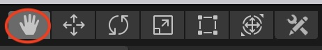

Use this tool to move the camera around the scene. This tool does not change the angle of where the camera is looking.

*Shortcut: You can also use the hand tool by dragging with the middle/scroll-wheel button on your mouse, or pressing Q.*

### Orbit Tool

Press the option (mac) or alt (windows) key to change the hand tool to the orbit tool. Now move the camera angle around with the mouse or trackpad

*Shortcut: You can also orbit the camera by dragging with the right mouse button*

### Zooming In/Out

Use the scroll wheel or trackpad scroll

## Manipulating Objects in the Scene

The 3D space in the scene is organized along a set of X-Y-Z axes. This axis gizmo in the top right of your scene tells you which axis is pointing where:

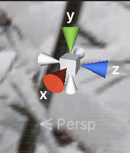

### Move Tool

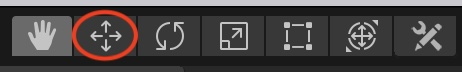

Select this tool, and select an object in the scene. You'll see controls on the object that look like this:

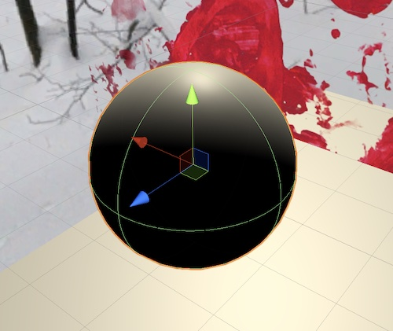

Move the red, green and blue arrows to move the object along the X, Y and Z axes. If you're unsure about which axis is whcih, try different arrows to see which direction the object moves in.

You can also move the object by dragging the small reg, green and blue squares at the center of the move controller. This moves the object along 3 different planes. If you're unsure how they work, try each one to see which directions it moves the object in.

*Shortcut: Access this tool using the the W key*

### Rotating 

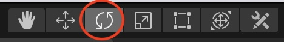

Select this tool and you'll see controls like this:

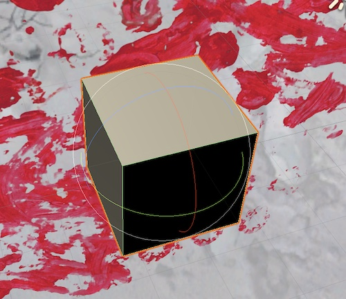

Drag the colored circles to rotate the object around different axes. 

*Shortcut: Access this tool using the the E key*

### Scaling

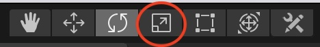

Select this tool and you'll see controls like this:

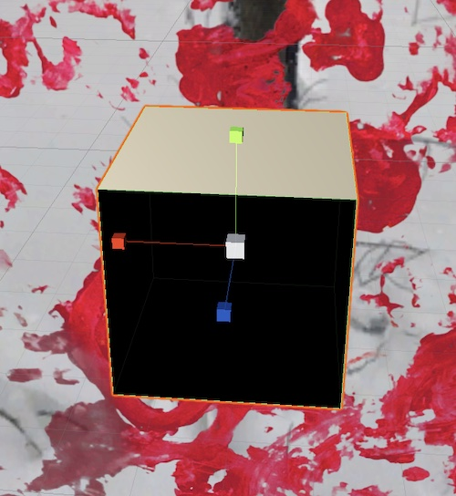

Click and drag the white box to scale the object up and down. Click and drag colored boxes to scale the object along single axes.

*Shortcut: Access this tool using the the R key*

## Creating 3D primitives (basic 3D shapes)

You won't do this often while using the Community Game Development Toolkit, but it can be useful to understand how to create basic 3D shapes in your scene. Note that 3D primitives in the scene show up in the scene hierarchy (the panel on the left), but do not show up in the project panel (the bottom of the window).

You can create primitives from the GameObjects menu:

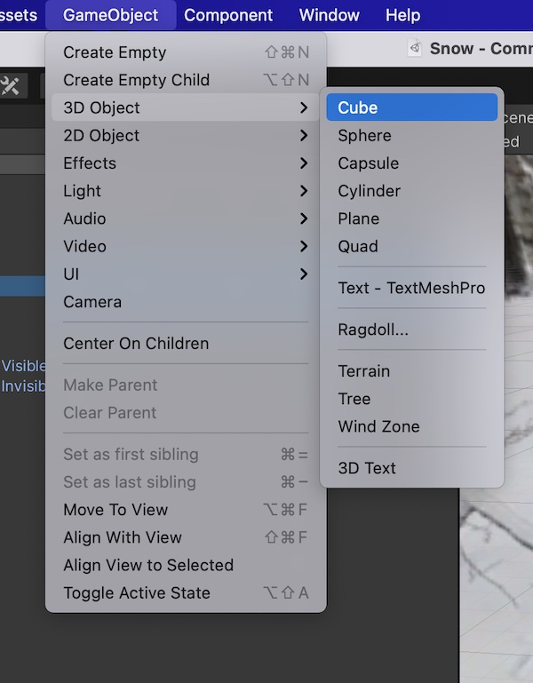

Also from the '+' button in the hierarchy panel:

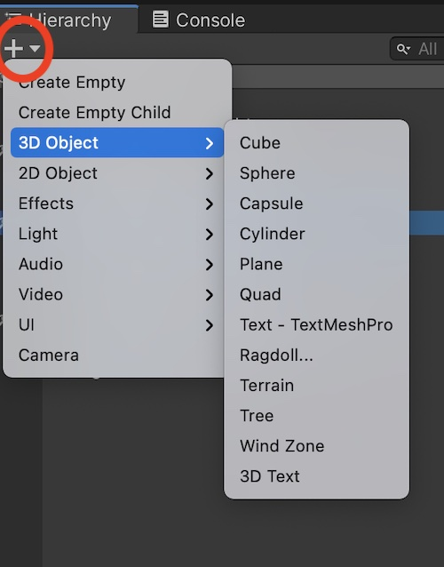

### Types of Objects

* Cube
* Sphere
* Capsule (pill shaped)
* Cylinder
* Quad: small, flat square surface. We will use these frequently
* Plane: large flat surface, often a ground to walk on
* *Don't worry about the rest of the shapes!*

<!---- begin statcounter ---->

<noscript>

    

</noscript>
<!-- end statcounter -->

