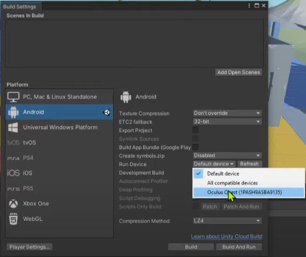
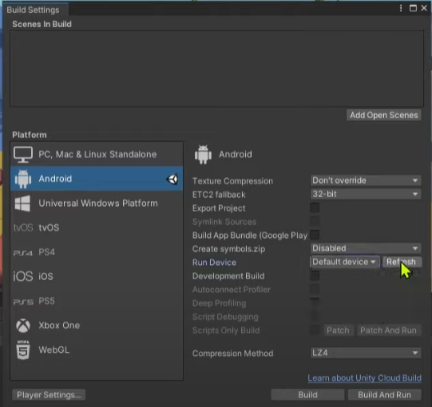
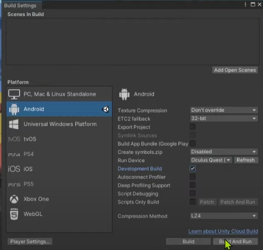

#Exporting your project to an Oculus Quest 2 Headset

1. If not on your computer Download and install the [Oculus software](https://www.oculus.com/download_app/?id=1582076955407037) (if that link doesn't work try [Oculus software Page](https://www.meta.com/quest/setup/?utm_source=www.meta.com&utm_medium=dollyredirect) )
2. After installation is complete sign in and connect your headset to the desktop with a cable and allow file read and write permisions
3. In the occlus go to, Settings ➡️ General ➡️ Unknown Sources and click the toggle button to allow unkown sources.
4. Next go to the Unity Project and go to, File ➡️ Build Settings, and select Oculus Quest in the dropdown menu for Run Device

    

5. If you can't find the Occulus Quest option hit refresh on the right side

    

6. Once Oculus Quest is selected hit Build and Run. It will ask you to save the project which you can choose any location on your computer and then it will directly install and run it on the Oculus Quest.

    

7. Once the project is done building put on the headset and the project should start. If not started automatically you can manually start your newly made app by filtering the apps on the Oculus by Unkown Sources and your app should show up there from which you can start.
8. Once completed your app is all good to go and you can run it from anywhere and it no longer needs to be connected to the computer to run since it is directly installed onto the headset. 
 

<!---- begin statcounter ---->

<noscript>

    

</noscript>
<!-- end statcounter -->
