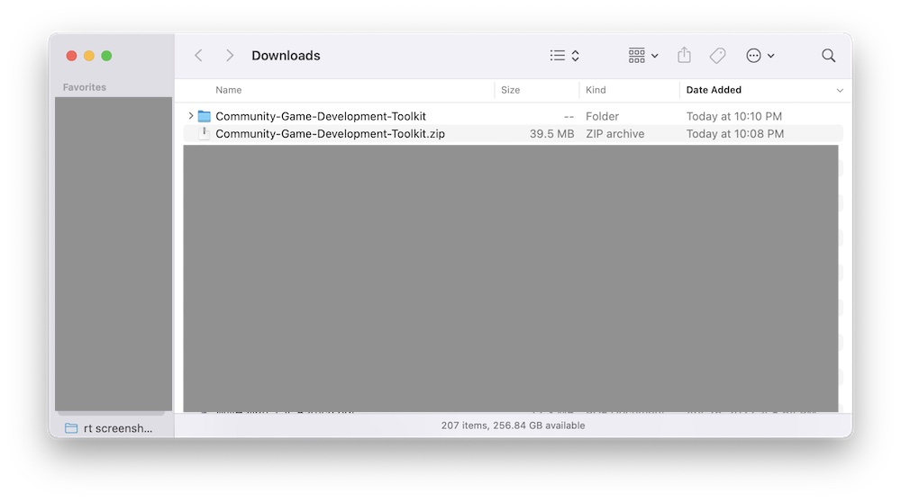
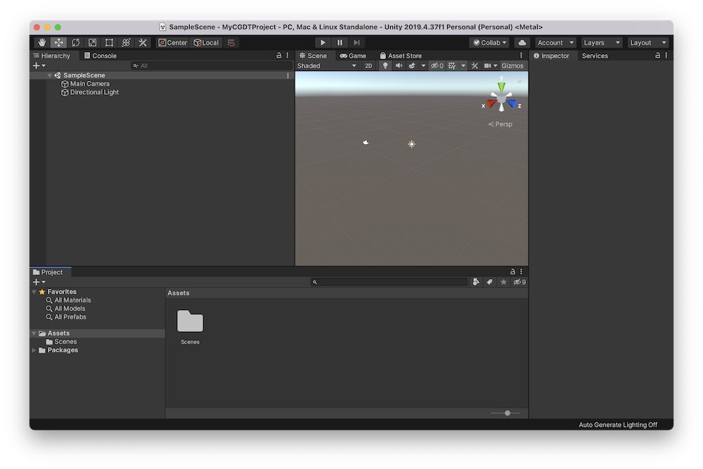
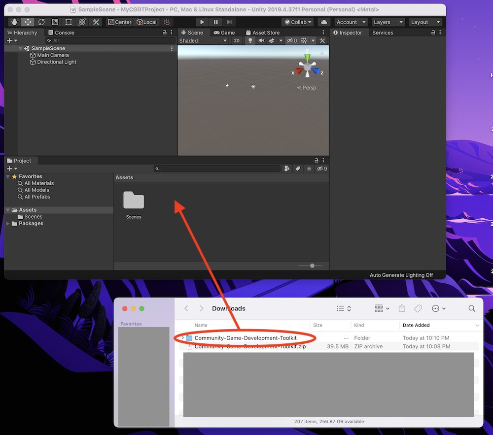
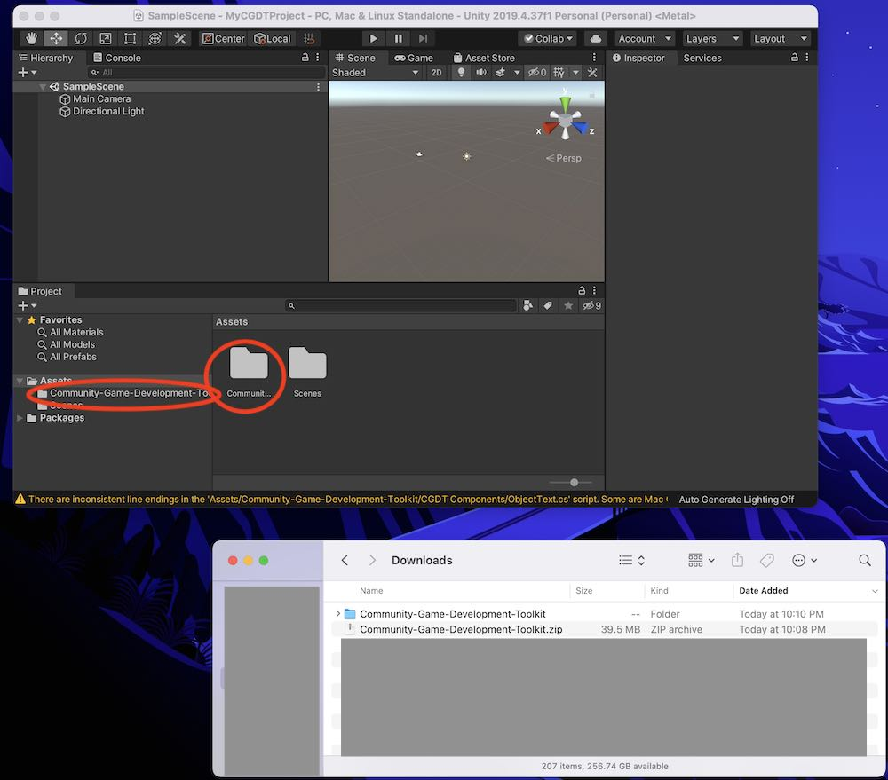
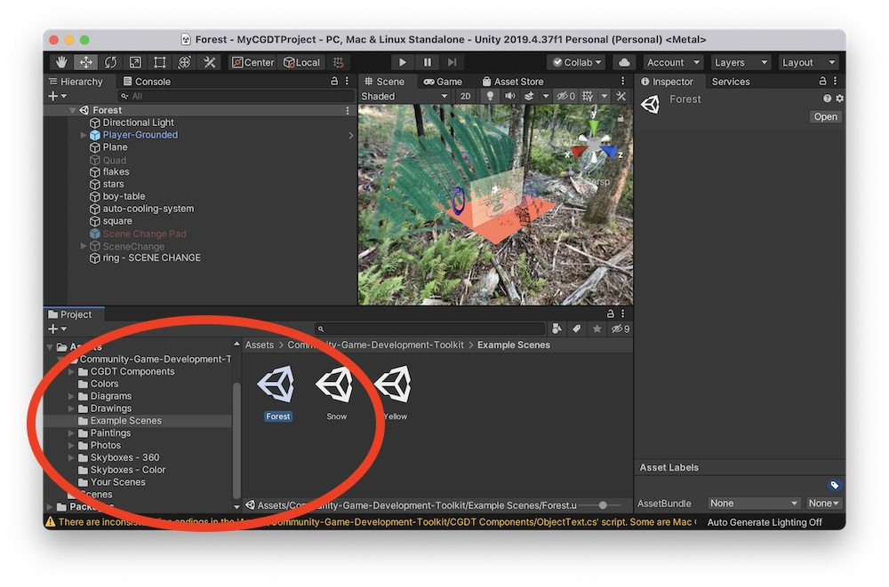

#Importing the Toolkit into your project

1. [Download](download.md) the toolkit
2. Find the file, probably in your downloads folder, and unzip it if it has not already been unzipped. Like this, for example:

3. Open your project in Unity. Here's what a new project looks like:

1. Now import the entire Community-Game-Development-Toolkit folder into your project. One way to do it is to drag the whole folder to the Project tab in your project:

1. Check that the toolkit made it into your Project tab. Note that you cannot always see the full file name in the project tab. Also note that we see the toolkit folder in the folder view (highlighted with the right circle), as well as in the folder hierarchy view (highlighted with the left circle):

1. Look throught the toolkit folders by opening them up in the folder hierarchy in the left, or double clicking the toolkit folder. Fine the 'Example Scenes' folder, and open an example scene to make sure everything is working:

<!---- begin statcounter ---->

<noscript>

    

</noscript>
<!-- end statcounter -->
