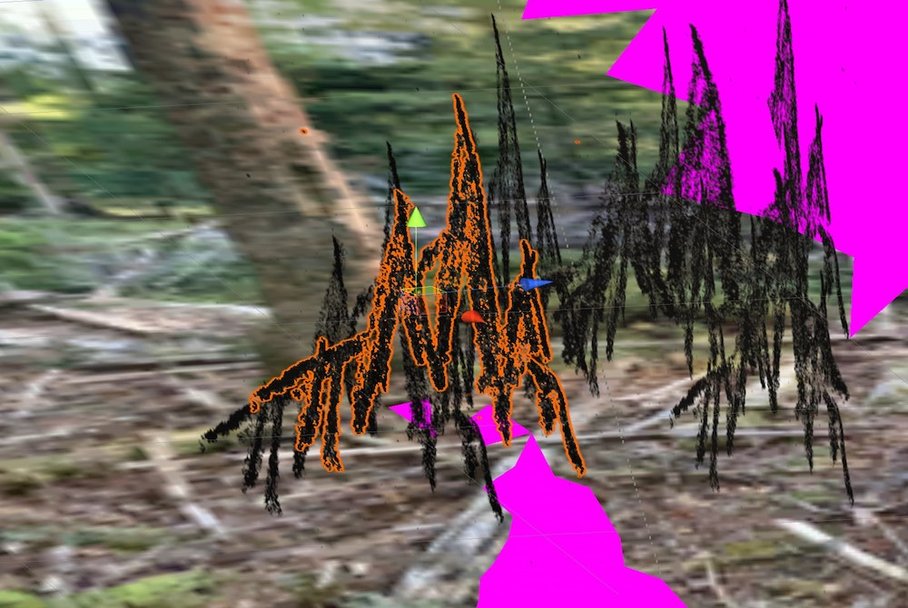
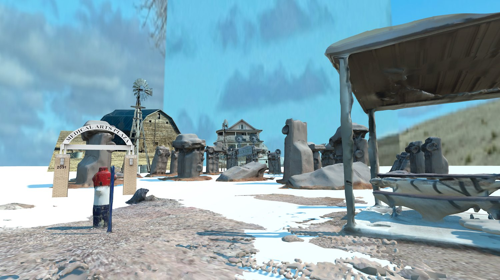
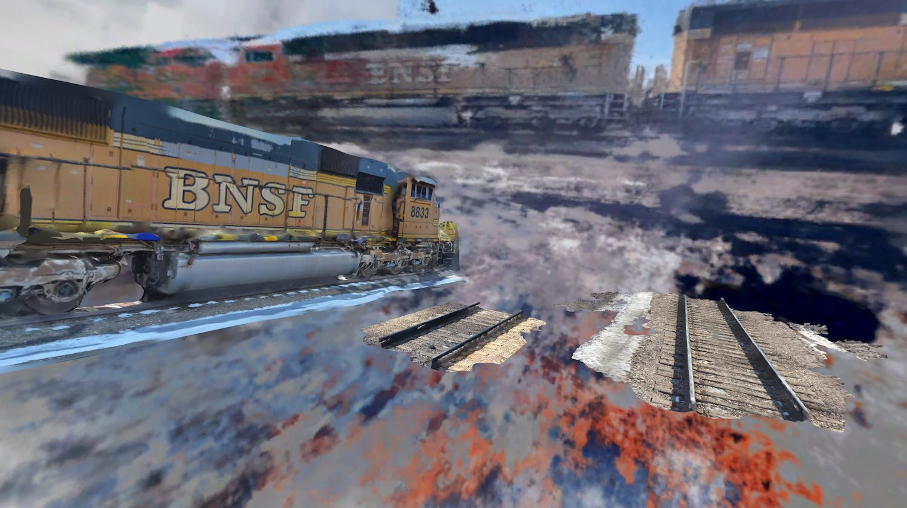
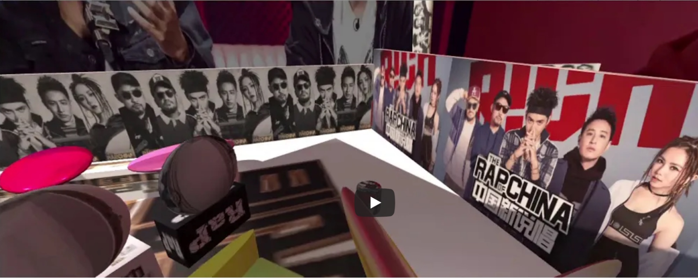
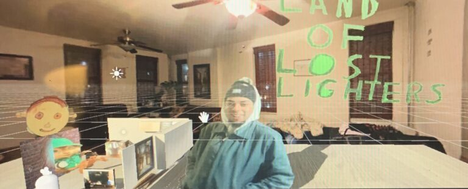
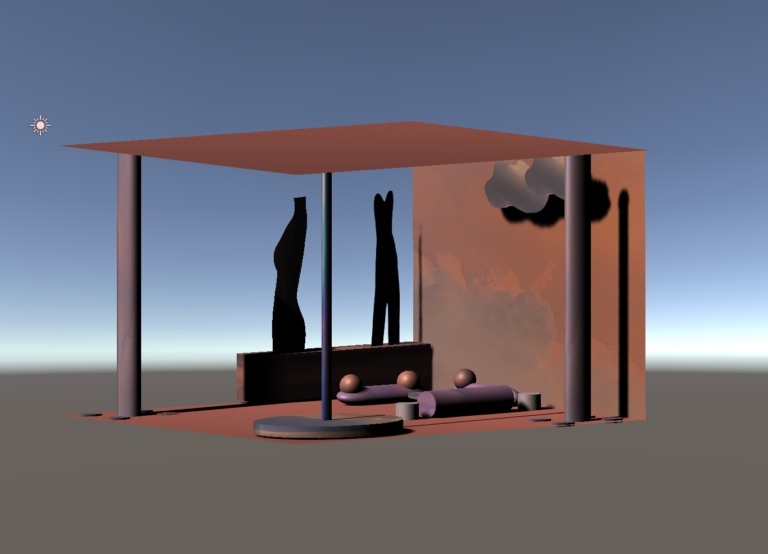

# The Community Game Development Toolkit

[Skip to How-To ⏩](howto.md)

[Skip to How-To-VR (Experimental) ⏩](howtoVR.md)

## What is it
The Community Game Development Toolkit is a set of tools that make it easy and fun for students, artists, researchers and community members to create their own visually rich, interactive 3D environments and story-based games without the use of coding or other specialized game-design skills. Building on the popular 3D game design engine Unity, the toolkit provides intuitive tools for diverse communities to represent their own traditions, rituals and heritages through interactive, visual storytelling. Projects can be built for desktop, mobile and VR applications.

## Toolkit functionality

* Use your own drawings, paintings and cuts out from photos to create 3D scenes
* Incorporate DIY 3D scans of objects and rooms
* Intuitively drag and drop drawings, paintings and photo cut outs into scenes -- toolkit automatically formats images
* Use transparency in drawings, paintings and photo cut outs to easily create rich, organic visual composition in 3D space
* Take your own 360-degree photos and use as interactive, photogarphic backgrounds to your scenes
* Use a flying player (moves freely through 3D space) or a grounded player (moves along a ground plane in the scene) to interact with your scenes
* Create Scene Change elements -- when the player moves through specified visual elements, they are transported to another scene. Simply designate an element as a scene change, and select the scene the player should be transported to
* Add interactive caption text to objects in your scene
* Use scene changes to create interactive visual narrative

## Coming soon
* Use video/moving image textures
* Simple animated materials
* Title screens and pause screens
* And more...

## Long Term Goals

* Create web-based database of projects created using the toolkit

## Examples
### MetaEternity

By Teresa Braun, Ayodamola Okunseinde, June Bee, and Zelong Li

Toolkit used as part of a VR and performance installation at Practice Gallery, Philadelphia

### Alliance Project (work in progress)

By Ash Eliza Smith and Samantha Bendix

Project uses Toolkit to facilitate collective world buliding activities with community members in Alliance, Nebraska. Activities and workshops use interactive 3D collage to imagine and speculate about what kinds of public projects and material futures would benefit the community.

### The Raisin Truck Makes Raisins

by Daniel Lichtman with contributions Ian Giles, Helena Haimes, James Prevett, David Baumflek and Johann Arens.

A collaboratively produced interactive 3D environment that uses collage, abstraction and spatial orientation/disorientation to reflect on the experience of caring for young children during pandemic and lockdown.

[More Info](https://www.daniellichtman.com/raisintruck/)

### Collaborative Worldbuilding workshop at Museums Without Walls Conference, Museu sem Paredes / Queens University, 2022

### Collaborative Worldbuilding workshop at the Society for Language, Science and Art at Purdue University, 2022

### Student work using the Toolkit

   
Fangrou Zhou, student in New Media Arts Program, Baruch College, CUNY. Game world imagining participating in a Chinese reality music television show.

   
Nehemiah Lucena, student in New Media Arts Program, Baruch College, CUNY. Game scene remembering life before giving up the use of substances.

  
Sonam Lama, student in New Media Arts Program, Baruch College, CUNY

  
Areeb Khan, student in Digital Studies at Stockton University. Game scene imagining dream home for student's family.

## Context & Who uses the toolkit

The toolkit is being developed as part of the NSF-funded VR-REU program in immersive visualization and virtual/augmented/mixed reality at the Visualization and Virtual Reality Lab at Hunter College. It is being used to teach game design, worldbuilding and interactivtity at Baruch College, CUNY, Winona State University, University of Nebraska, Lincoln, Stockton University, and other universities. It is also being used by the the MetaEternity project listed above and by other artist and research groups. The toolkit plays a consulting role in the Ant Farm Art Building Creative Preservation Initiative (AFAAB) at Antioch College.

The toolkit has been presented at numerous conferences, workshops and exhibitions including iDMAa at Winona State University (2021, 2022), SLSA at Purdue University (2021, 2022), Museums Without Walls at the Museu sem Parades (2022) the Show Don't Tell Symposium at Culture Push (2021) and the New Media Caucus Showcase at the College Art Association Conference (2021)

## How to use the toolkit
[Go to How To page](howto.md)

[Go to How To VR page](howtoVR.md)

## Get involved / questions / contact
Contact Daniel Lichtman at daniel.lichtman at stockton dot edu.

<!---- begin statcounter ---->

<noscript>

    

</noscript>
<!-- end statcounter -->
 

