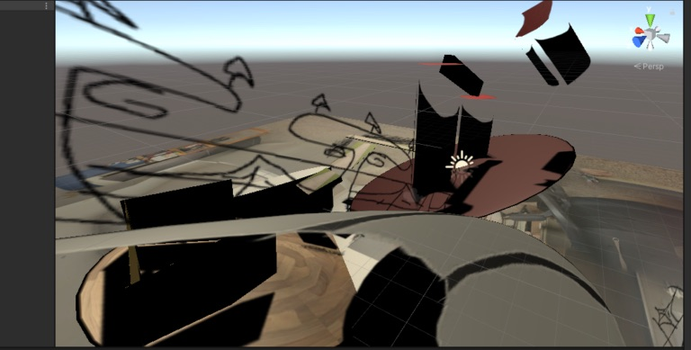

# The Community Game Development Toolkit

[Skip to How-To ⏩](howto.md)

## What is it
The Community Game Development Toolkit is a set of tools that make it easy and fun for students, artists, researchers and community members to create their own visually rich, interactive 3D environments and story-based games without the use of coding or other specialized game-design skills. Building on the popular 3D game design engine Unity, the toolkit provides intuitive tools for diverse communities to represent their own traditions, rituals and heritages through interactive, visual storytelling. Projects can be built for desktop, mobile and VR applications.

## Toolkit functionality

* Use your own drawings, paintings and cuts out from photos to create 3D scenes
* Intuitively drag and drop drawings, paintings and photo cut outs into scenes -- toolkit automatically formats images
* Use transparency in drawings, paintings and photo cut outs to easily create rich, organic visual composition in 3D space
* Take your own 360-degree photos and use as interactive, photogarphic backgrounds to your scenes
* Use a flying player (moves freely through 3D space) or a grounded player (moves along a ground plane in the scene) to interact with your scenes
* Create Scene Change elements -- when the player moves through specified visual elements, they are transported to another scene. Simply designate an element as a scene change, and select the scene the player should be transported to
* Use scene changes to create interactive visual narrative

## Coming soon

* Use video/moving image textures
* Interactive text
* Simple animated materials
* Title screens and pause screens
* VR pipeline  
* And more...

## Long Term Goals

* Arrange and compose visual assets in an interactive game mode rather than in the Unity Editor
* Create scene changes in an interactive game mode
* --> provide workflow for avoiding the use of the Untiy environment all together
* Arrange and compose scenes in VR
* Create web-based database of projects created using the toolkit

## Examples
### The Raisin Truck Makes Raisins

by Daniel Lichtman with contributions Ian Giles, Helena Haimes, James Prevett, David Baumflek and Johann Arens.

A collaboratively produced interactive 3D environment that uses collage, abstraction and spatial orientation/disorientation to reflect on the experience of caring for young children during pandemic and lockdown.

[More Info](https://www.daniellichtman.com/raisintruck/)

### MetaEternity

By Teresa Braun, Ayodamola Okunseinde, June Bee, and Zelong Li

Toolkit used as part of a VR and performance installation at Practice Gallery, Philadelphia

### Student work from the New Media Art program at Baruch College, CUNY

More examples coming soon!

## Context

The toolkit is being developed as part of the NSF-funded VR-REU program in immersive visualization and virtual/augmented/mixed reality at the Visualization and Virtual Reality Lab at Hunter College, used in the MetaEternity project listed above, taught in games courses at Baruch College, CUNY and other CUNY campuses, plays a consulting role in the Ant Farm Art Building Creative Preservation Initiative (AFAAB) at Antioch College and has been featured in workshops at universities and institutions across the country.

The toolkit has been presented at numerous conferences, workshops and exhibitions including iDMAa at Winona State University (2021, 2022), SLSA at Purdue University (2021, 2022), Museums Without Walls at the Museu sem Parades (2022) the Show Don't Tell Symposium at Culture Push (2021) and the New Media Caucus Showcase at the College Art Association Conference (2021)

## How to use the toolkit
[Go to How To page](howto.md)

## Get involved / questions / contact
Contact Daniel Lichtman at danielp73 at gmail dot com.

<!---- begin statcounter ---->

<noscript>

    

</noscript>
<!-- end statcounter -->
 

