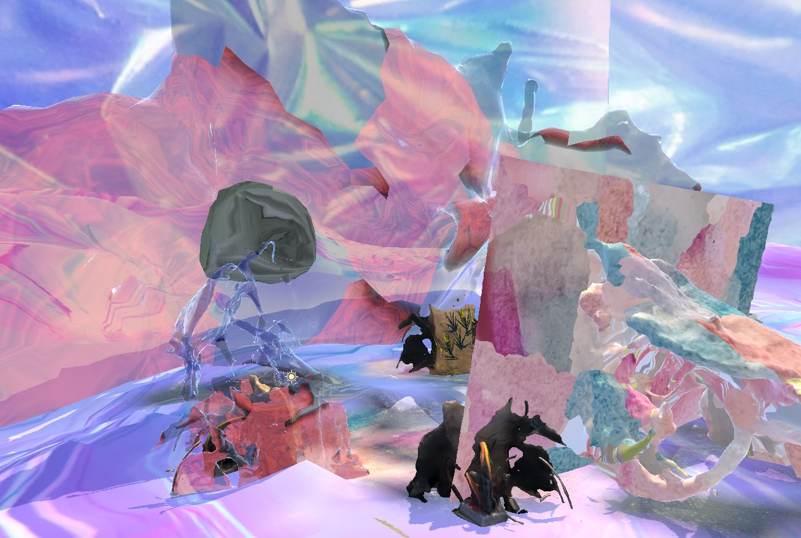
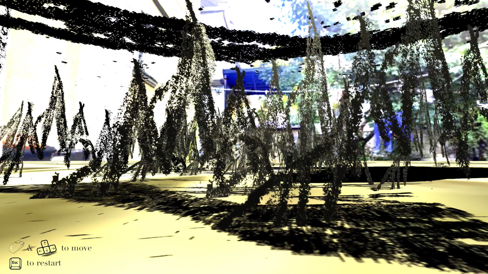
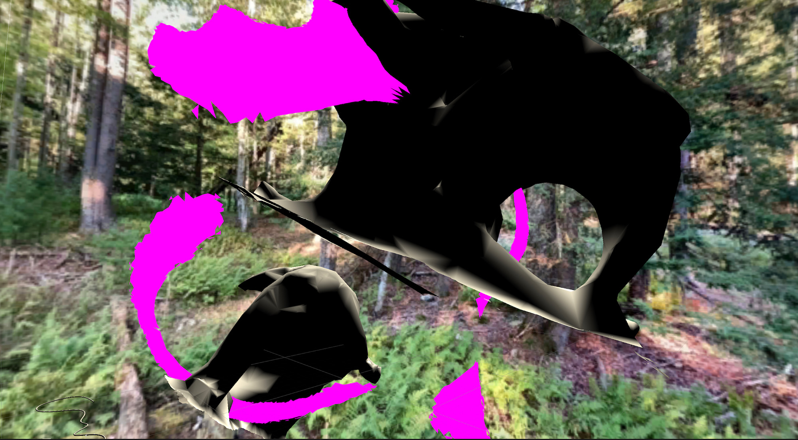
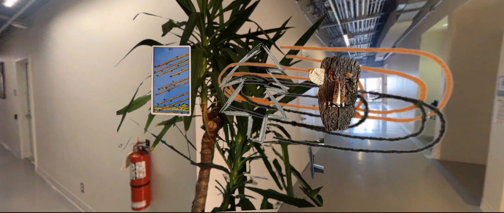
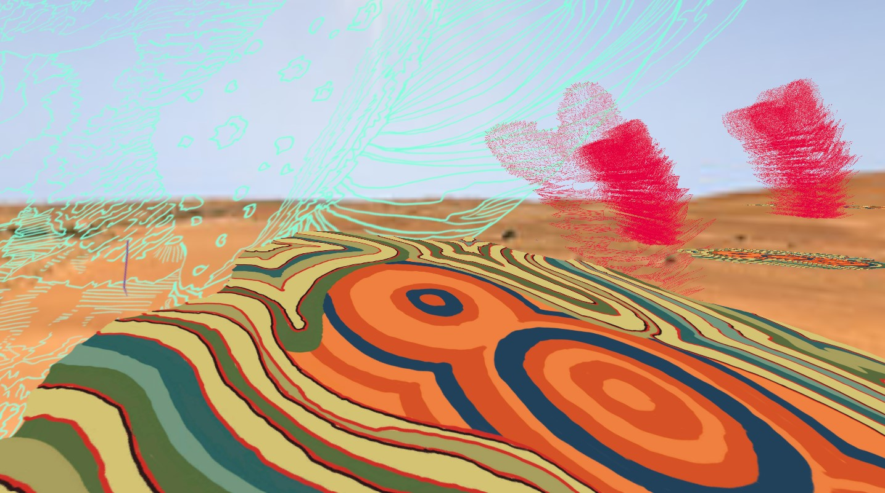
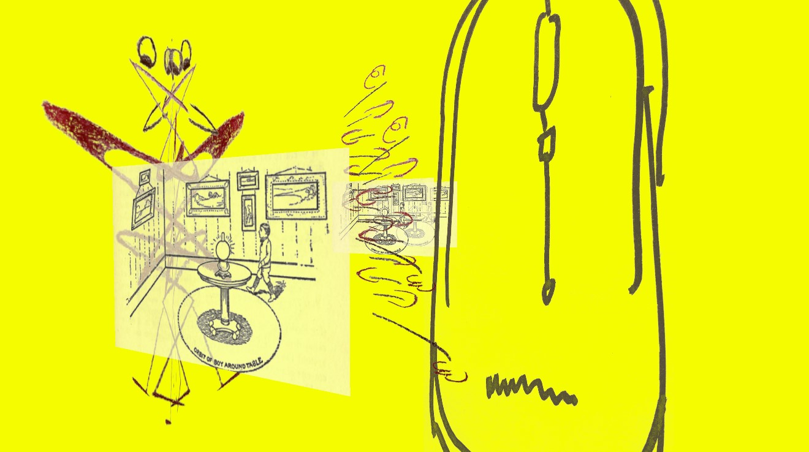
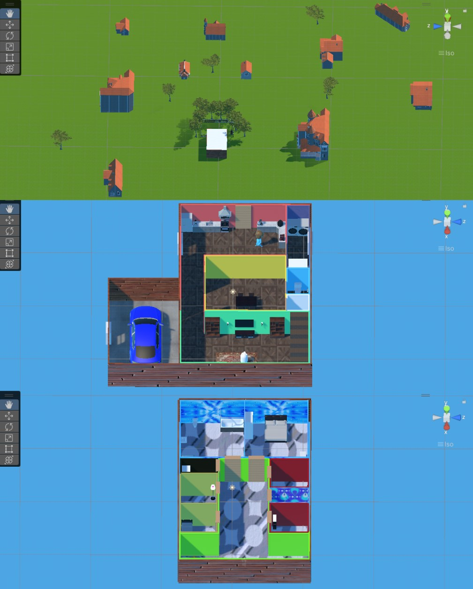

[Skip to How-To ⏩](howto.md)

[Skip to How-To-VR (Experimental) ⏩](howtoVR.md)

## What is it
The Community Game Development Toolkit is a set of tools that make it easy and fun for students, artists, researchers and community members to create their own visually rich, interactive 3D environments and story-based games without the use of coding or other specialized game-design skills. Building on the popular 3D game design engine Unity, the toolkit provides intuitive tools for diverse communities to represent their own traditions, rituals and heritages through interactive, visual storytelling. Projects can be built for desktop, mobile and VR applications.

## Projects Created with the Communtiy Game Development Toolkit
### In The Middle

By Ash Eliza Smith, Samantha Bendix and Daniel Lichtman

Project explores how worldbuilding, speculative fiction, and co-creation can shape collective futures, imagining new possibilities for community-driven innovation. Our project, The Middle, is a prototype for a digital platform—a story engine—where all communities, regardless of size or location, can archive their hopes and dreams through interactive tools like 3D collage, storytelling, pen drawings, and audio recordings. The platform, a game-like environment, invites audiences to navigate these creative contributions at their own pace, fostering an inclusive and collaborative space for imagination and action. Ultimately, The Middle is designed to serve as a repository for the future vision and desires of any community or collective, supporting communities to reimagine collective futures in complex realities.

In this pilot implementation of the platform, a series of interactive virtual worlds were developed during worldbuilding sessions in a rural town in Nebraska, engaging individuals affected by Substance Use Disorder as well as school students, healthcare workers and members of other communities. Community members co-created stories and innovative solutions to questions regarding the future of community health and wellbeing. Participants then composed a series of interactive scenes to express and reflect on these ideas using 3D scans of local physical and cultural geography, photos, drawings, illustrations, and audio recordings.

[More Info](https://www.daniellichtman.com/middle/)

### MetaEternity

By Teresa Braun, Ayodamola Okunseinde, June Bee, and Zelong Li

Toolkit used as part of a VR and performance installation at Practice Gallery, Philadelphia

### The Raisin Truck Makes Raisins

by Daniel Lichtman with contributions Ian Giles, Helena Haimes, James Prevett, David Baumflek and Johann Arens.

A collaboratively produced interactive 3D environment that uses collage, abstraction and spatial orientation/disorientation to reflect on the experience of caring for young children during pandemic and lockdown.

[More Info](https://www.daniellichtman.com/raisintruck/)

### Collaborative Worldbuilding workshop at Museums Without Walls Conference, Museu sem Paredes / Queens University, 2022

### Collaborative Worldbuilding workshop at the Society for Language, Science and Art at Purdue University, 2022

### Student work using the Toolkit

   
Fangrou Zhou, student in New Media Arts Program, Baruch College, CUNY. Game world imagining participating in a Chinese reality music television show.

   
Nehemiah Lucena, student in New Media Arts Program, Baruch College, CUNY. Game scene remembering life before giving up the use of substances.

  
Sonam Lama, student in New Media Arts Program, Baruch College, CUNY

  
Areeb Khan, student in Digital Studies at Stockton University. Game scene imagining dream home for student's family.

## Context & Who uses the toolkit

The toolkit is being developed as part of the NSF-funded VR-REU program in immersive visualization and virtual/augmented/mixed reality at the Visualization and Virtual Reality Lab at Hunter College. It is being used to teach game design, worldbuilding and interactivtity at Baruch College, CUNY, Winona State University, University of Nebraska, Lincoln, Stockton University, and other universities. It is also being used by the the MetaEternity project listed above and by other artist and research groups. The toolkit plays a consulting role in the Ant Farm Art Building Creative Preservation Initiative (AFAAB) at Antioch College.

The toolkit has been presented at numerous conferences, workshops and exhibitions including iDMAa at Winona State University (2021, 2022), SLSA at Purdue University (2021, 2022), Museums Without Walls at the Museu sem Parades (2022) the Show Don't Tell Symposium at Culture Push (2021) and the New Media Caucus Showcase at the College Art Association Conference (2021)

## How to use the toolkit
[Go to How To page](howto.md)

[Go to How To VR page](howtoVR.md)

## Get involved / questions / contact
Contact Daniel Lichtman at lichtmad at stjohns dot edu.

<!---- begin statcounter ---->

<noscript>

    

</noscript>
<!-- end statcounter -->
 

