[⬅️ back home](intro.html)

# Tutorial - Using Example Assets

Using the toolkt is easy! Get a taste of how to use it by experimenting with example assets.

## Create a scene to work with

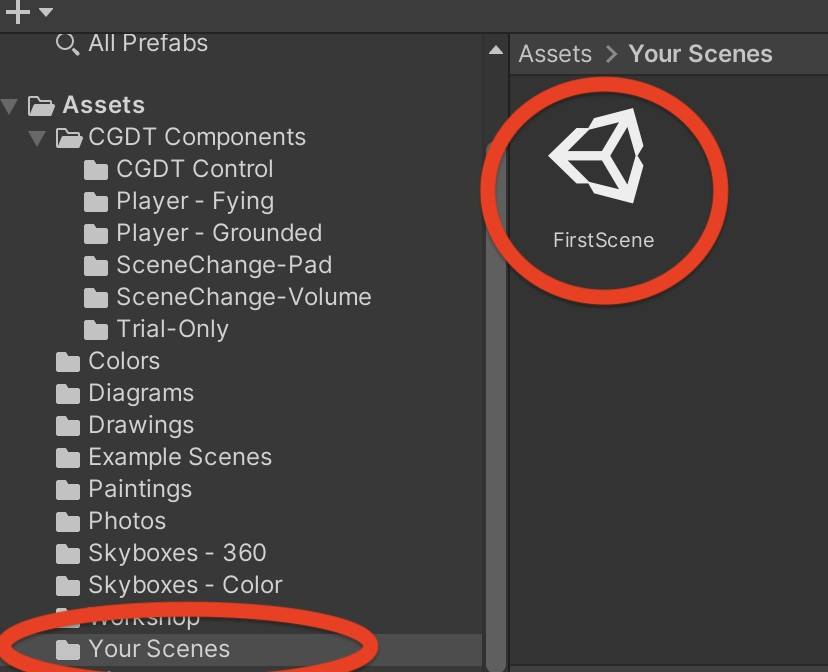

* In the Project panel, click on the Your Scenes folder
* In the Assets menu, choose Create->Scene
* The scene will appear on the right.
* Right-click it and choose Rename. Give it a name. Here It's called FirstScene
* In the scene view, you'll see the default, empty scene:

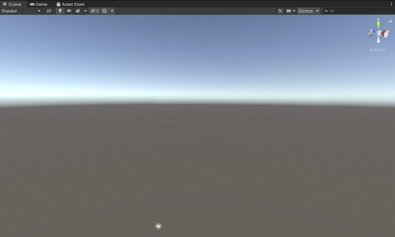

## Add one of the example drawings

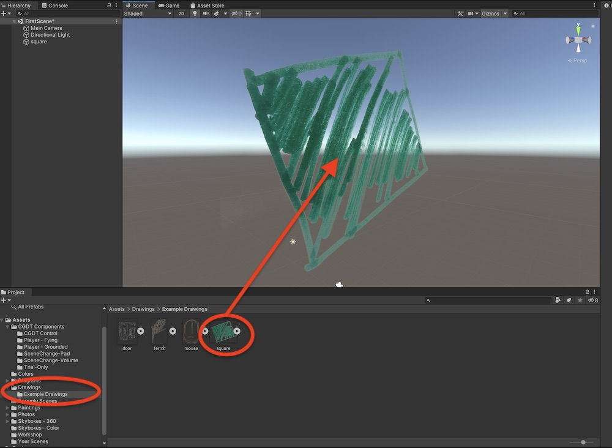

* In the project Panel, open up the Drawings folder to show the Example Drawing folder. Click on that.
* Drag square.png to the scene view
* Try moving it around using tools described in the [Navigating The Unity Interface](NavigatingTheUnityInterface.md) tutorial

## Add another drawing and access from hierachy panel

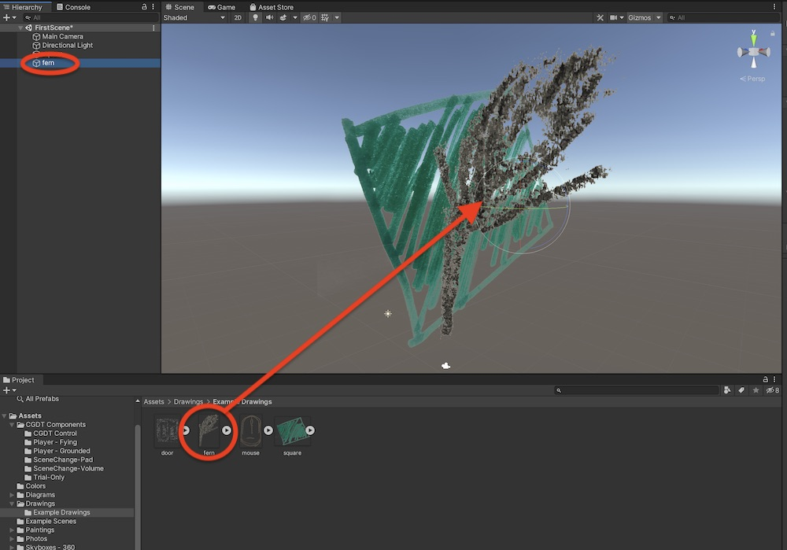

* Drag the fern into the scene view
* Notice that an object called 'fern' apperas in the Hierachy panel. The Hierachy panel lists objects curreny in the scene
* You can rename the fern (ex: Fern 1, Black Fern, etc)

## Add a painting

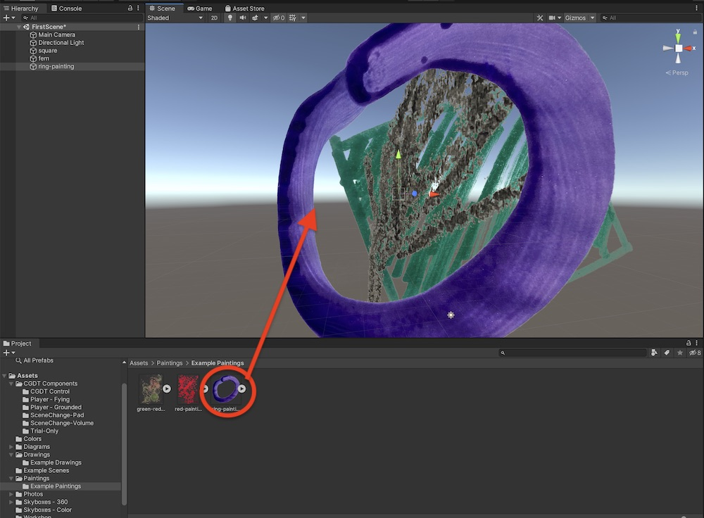

* Find the Painting->Example Paintings folder in the project panel
* Drag ring-painting to the scene
* Move, rotate and scale the painting in the scene

## Add a diagram

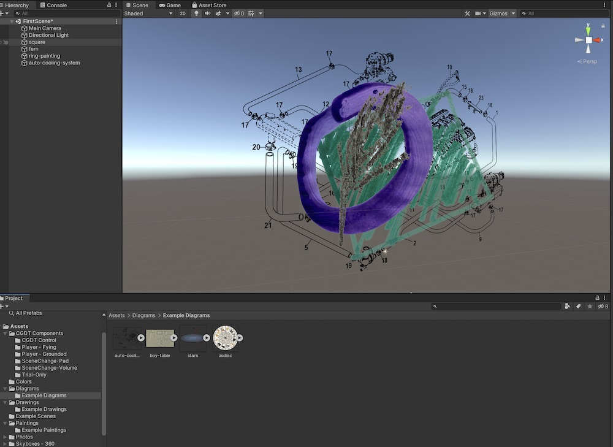

* Follow the same steps

## Add a background color

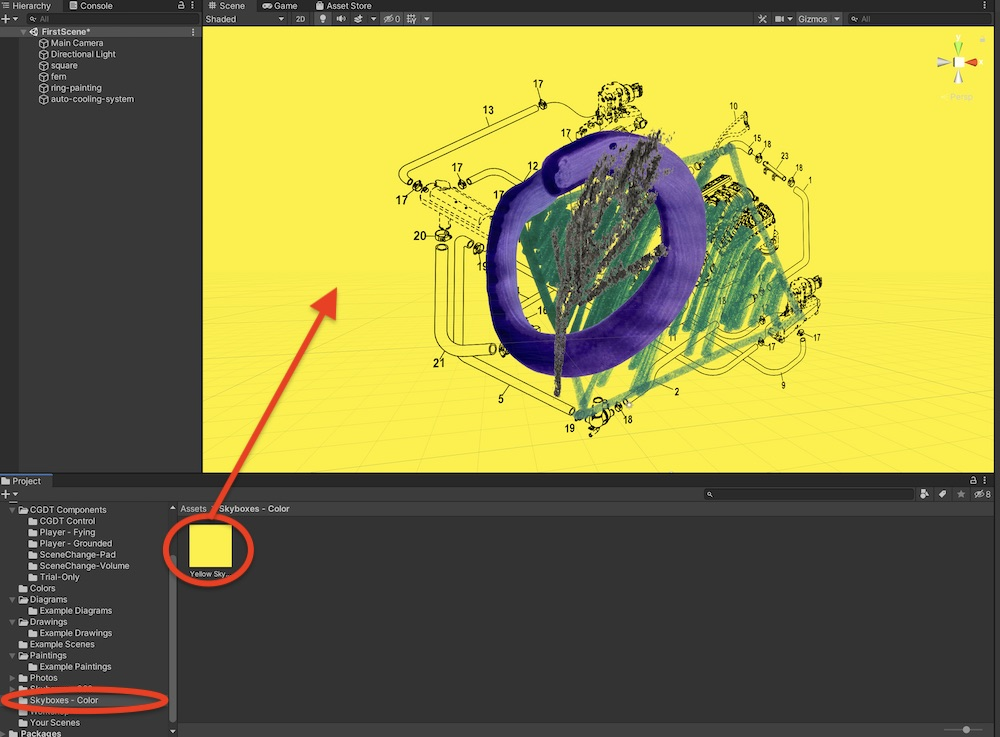

* Find the Skyboxes - Color folder in the project panel
* Drag 'Yellow Skybox' to the scene

## OR add a 360-degree photo skybox (scene background)

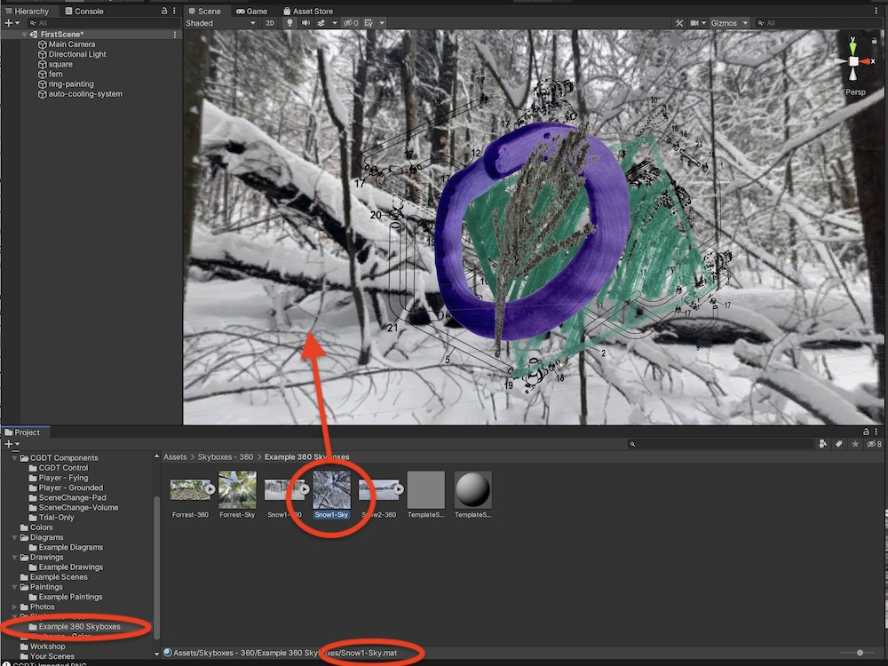

* Select the folder Skyboxes - 360 --> Example 360 Skyboxes in the Project Panel
* Find the file Snow1-Sky.mat. Confirm the name at the bottom of the window (circled).
* Drag to the scene

## Add a movable player to the scene

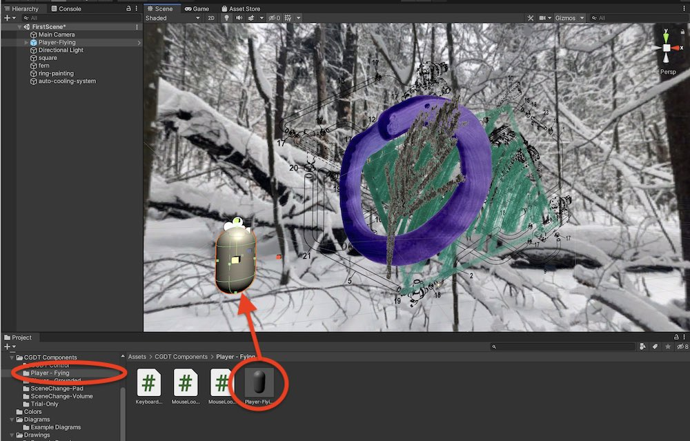

* Find the CGDT Components --> Player Flying folder in the Project panel
* Drag Player-Flying to the scene
* Note: Player-Flying is a player that moves around freely in 3D space. Player-Grounded moves only along the ground.

## Play the scene!

* Press Command-P (mac) / Control-P (windows) to enter Play mode
* Or, press the play button above the Scene Panel
* Use the mouse to look around
* Use the arrow keys, or ASDW keys to move the character through the scene

## Now add a scene change
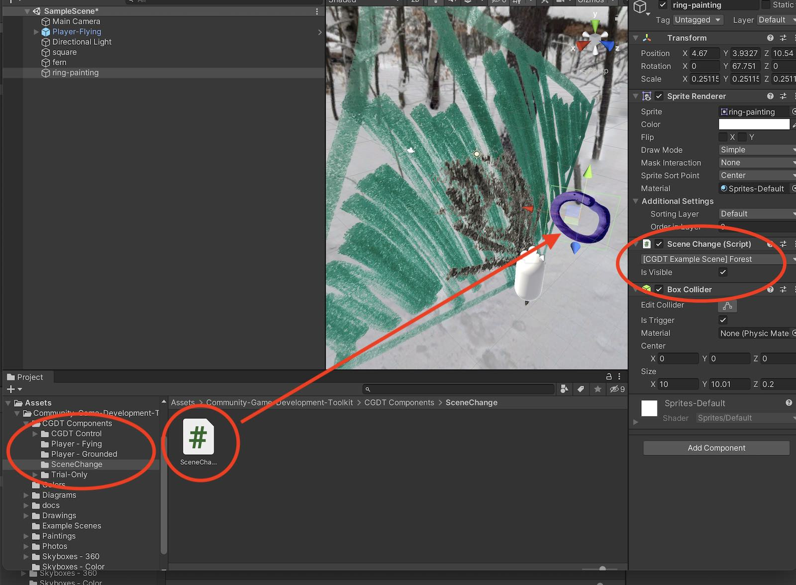

* Scene change elements are obejcts that transport the player to another scene when the player passes through the object. Any object (drawing, painting, diagram, photo cut-out) can function as a scene change object.
* Here we will use the purple ring painting as a scene change object (because it looks vaguely like a portal -- but it is up to you what a scene change should look like)
* Here we scaled-down the ring painting and positioned in front of other objects to make it noticable. 
* In the Projects tab, select the CGDT Components -> SceneChange folder
* Drag the SceneChange script to the purple ring in the scene
* Make sure you currectly added the script by checking that the scene change component shows up in the inspector (on the right) when the purple ring is selceted.

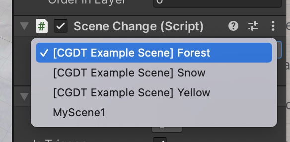

* Choose which scene you want your player to be transported to using the drop down menu (example scenes included in the toolkit are indicated with [CGDT Example Scene]. Here we've selected the example scene, Forest.
* Play your scene -- move the player through the purple ring and you will be transported to the Forest Scene.

##Create interactive narrative
* Make more new scenes, and add scene change objects that take the player from one scene to another!

