#VR Project Setup: Settings and Plugins

1. After creating a 3D project from the 3D Core template Open the Project settings
2. Edit ➡️ Project Settings

   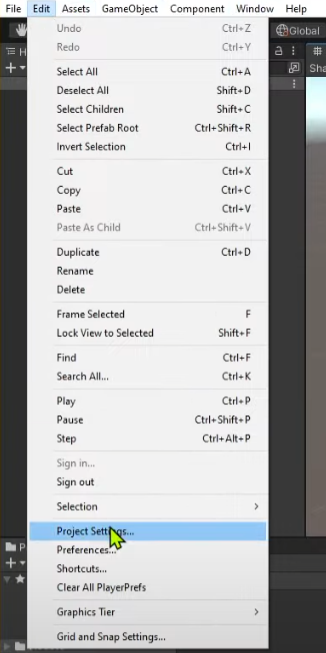

3. Once the Project settings are open go to, XR plugin management ➡️ Install XR Plugin Management, and then click Install XR Plugin Component

   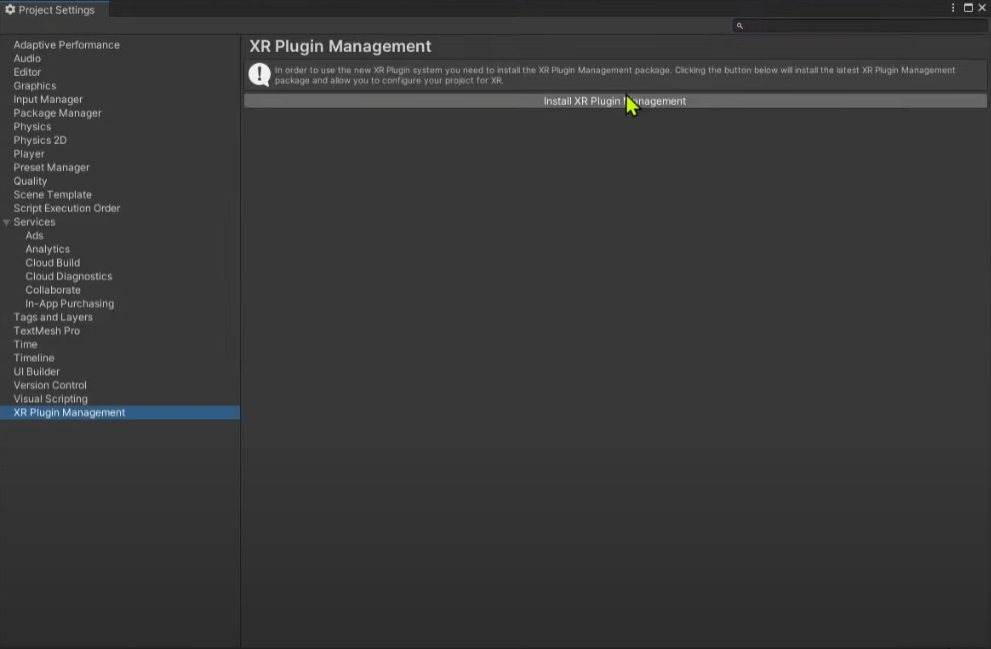

4. Then once installed in the same location, XR plugin management ➡️ Install XR Plugin Management, select the Occulus option for both Desktop and for Android

   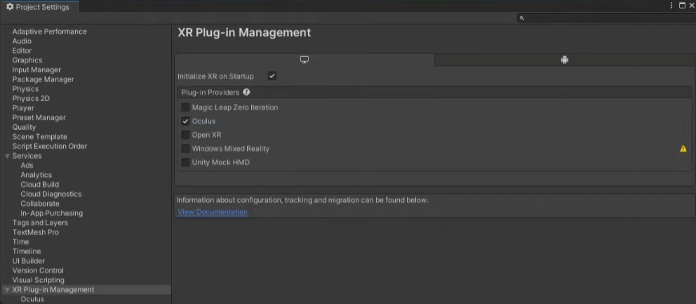
   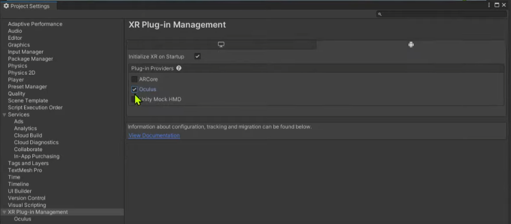

5. Next go to, File ➡️ Build Settings

   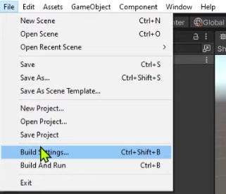

6. Select the Andriod option and click Switch Platform

   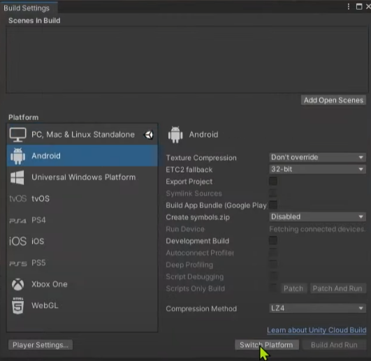

7. Open Player Settings

   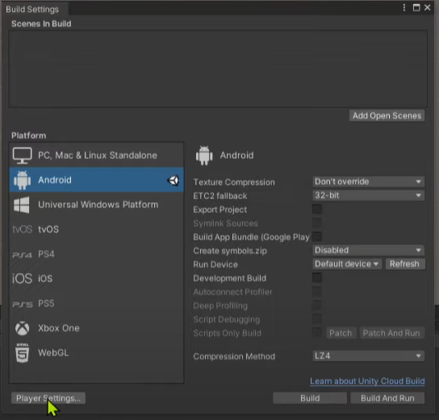

8. Set Player Minimum API level to Android 6.0 Marshmallow (API level 23) in, Other Settings ➡️ Minimum API Level

   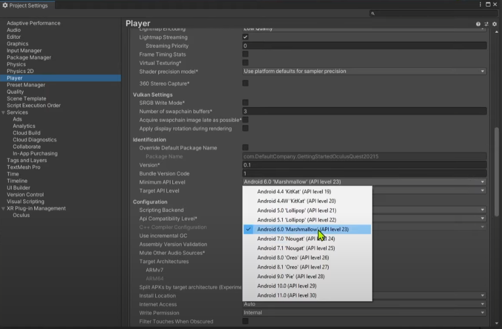

9. Open the Package Manager window in, Window ➡️ Package Manager

   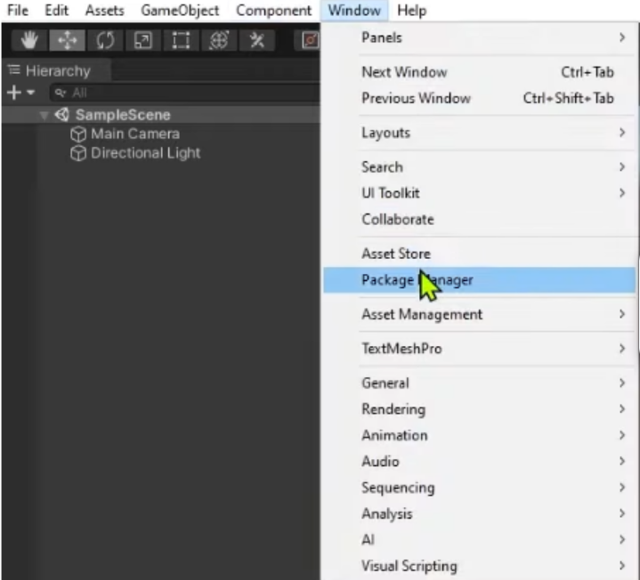

10. Open Advaced Project Settings by clicking the ⚙️ in the top right corner
   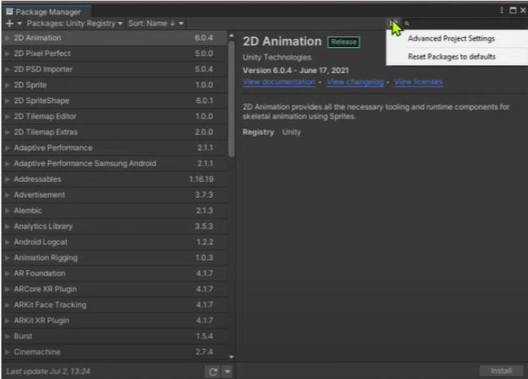

11. Enable Pre-release Packages by clicking the check box, click "I Understand" for the poppup
  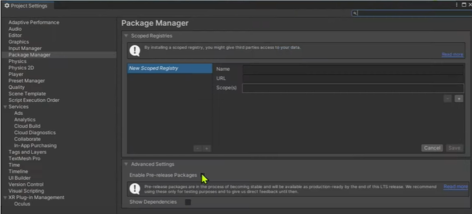

12. Go back to the Package Manager, Window ➡️ Package Manager,
13. Make sure that you are filtering by Unity Registry by using the drop down menu in the Top Left of the window and search for XR in the top right search bar
14. click on XR Interaction Toolkit

    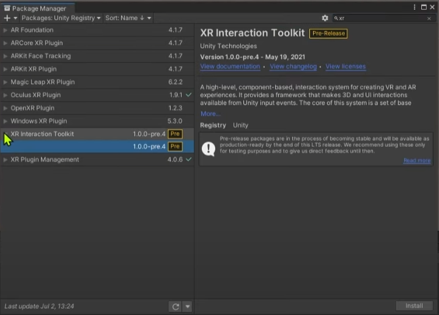

15. Click Install in the bottom right corner
16. Select Yes for the popup warning

    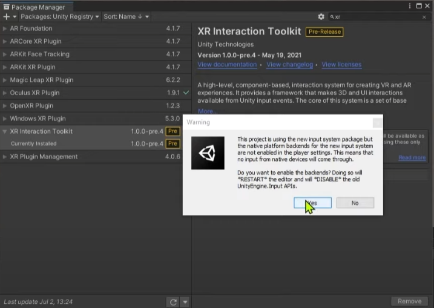

17. The project will restart
18. Once restarted go to, Window ➡️ Package Manager ➡️ XR Interaction Toolkit, and import the Starter Assets

    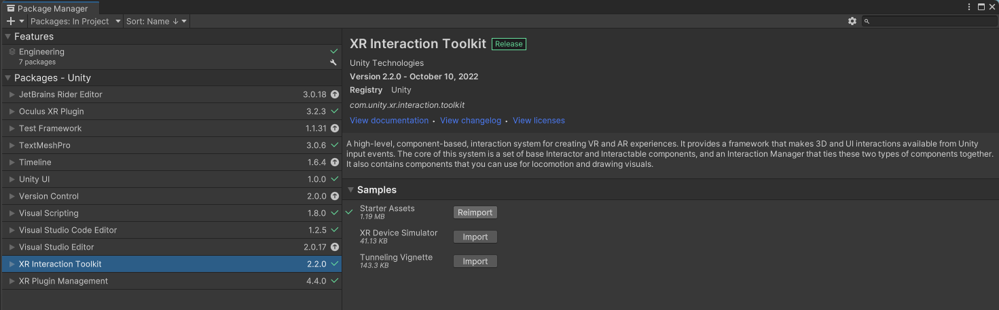

19. Next go to your Project window and find the imported starter assets at, Assets ➡️ Samples ➡️ XR Interaction Toolkit ➡️ 2.2 ➡️ Starter Assets,

    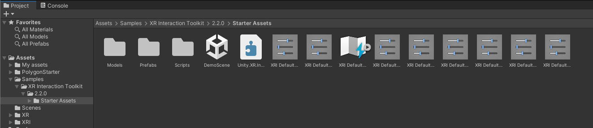

20. Select each of the XRI Default icons, there should be 8 or more of them

    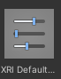

21. and in the inspection pannel at the top press Add to ActionBasedContinuousMoveProvider

    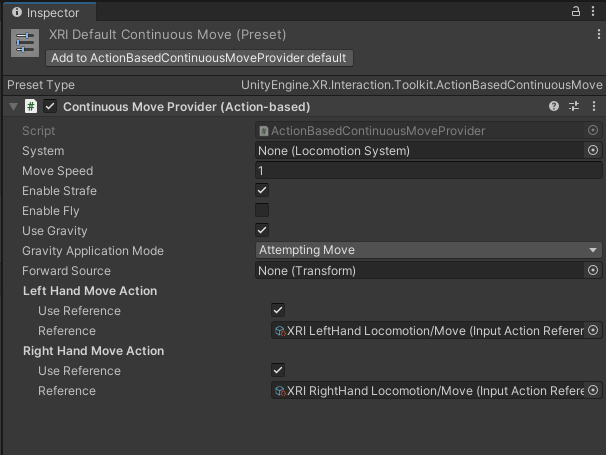

22. Go to, Edit ➡️ Project Settings ➡️ Preset manager

    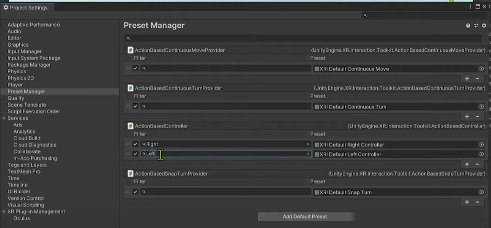

24. For all the left and right controller (Can be seen in the right collum ex: XRI Default Right Controller) for the right ones type "Right" in the left collum and for the left ones type "Left" in the same left collum in the same row

    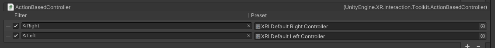

26. You made it!
27. Next step is to add the Community Game Development Toolkit [Community Game Development Toolkit](ImportToolkit.md)

<!---- begin statcounter ---->

<noscript>

    

</noscript>
<!-- end statcounter -->
